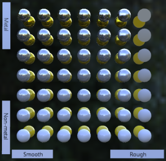

# Metal-Rough Spheres

## Tags

, 

## Summary

Tests various metal and roughness values (texture mapped).

## Screenshot

## Legal

&copy; 2017, Analytical Graphics, Inc.. [CC BY 4.0 International](https://creativecommons.org/licenses/by/4.0/legalcode)

 - Ed Mackey for Everything

#### Generated by modelmetadata 0.20.25