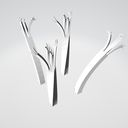

# Recursive Skeletons

## Tags

, , 

## Summary

Tests unusual skinning cases with reused meshes and recursive skeletons.

## Screenshot

## Legal

&copy; 2017, Cesium. [CC-BY 4.0](https://creativecommons.org/licenses/by-nd/4.0/legalcode)

 - Cesium for Everything

#### Generated by modelmetadata 0.10.0