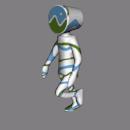
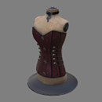
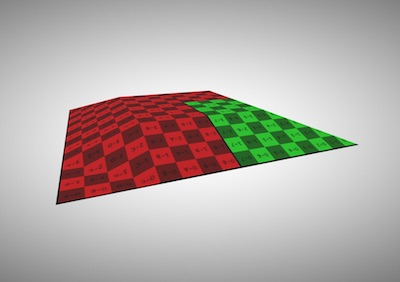
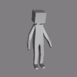
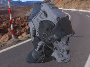
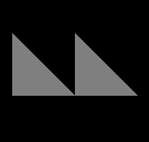
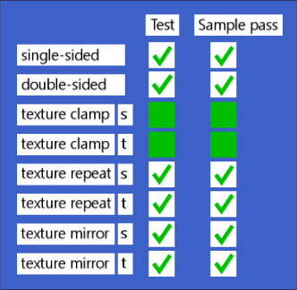

# glTF 2.0 Sample Models

## Models tagged with **core**

| Model   | Description |
|---------|-------------|
| [2 Cylinder Engine](./2.0/2CylinderEngine/README.md)  [Show in Sample Viewer](https://github.khronos.org/glTF-Sample-Viewer-Release/?model=https://raw.GithubUserContent.com/KhronosGroup/glTF-Sample-Models/master/./2.0/2CylinderEngine/glTF/2CylinderEngine.gltf) | Small CAD data set, including hierarchy. Credit: &copy; 2017, Unknown. [Khronos-Archive]()  - Khronos for Everything &copy; 2017, Unknown. [Khronos-Archive]()  - Okino for Conversion to glTF |
| [Alpha Blend Mode Test](./2.0/AlphaBlendModeTest/README.md)  [Show in Sample Viewer](https://github.khronos.org/glTF-Sample-Viewer-Release/?model=https://raw.GithubUserContent.com/KhronosGroup/glTF-Sample-Models/master/./2.0/AlphaBlendModeTest/glTF/AlphaBlendModeTest.gltf) | Tests alpha modes and settings. Credit: &copy; 2018, Analytical Graphics, Inc.. [CC-BY 4.0](https://creativecommons.org/licenses/by-nd/4.0/legalcode)  - Ed Mackey for Everything |
| [Animated Cube](./2.0/AnimatedCube/README.md)  [Show in Sample Viewer](https://github.khronos.org/glTF-Sample-Viewer-Release/?model=https://raw.GithubUserContent.com/KhronosGroup/glTF-Sample-Models/master/./2.0/AnimatedCube/glTF/AnimatedCube.gltf) | Same as previous cube having a linear rotation animation. Credit: &copy; 2017, UX3D. [CC0](https://creativecommons.org/publicdomain/zero/1.0/legalcode)  - Norbert Nopper for Everything |
| [Animated Morph Cube](./2.0/AnimatedMorphCube/README.md)  [Show in Sample Viewer](https://github.khronos.org/glTF-Sample-Viewer-Release/?model=https://raw.GithubUserContent.com/KhronosGroup/glTF-Sample-Models/master/./2.0/AnimatedMorphCube/glTF/AnimatedMorphCube.gltf) | Demonstrates a simple cube with two simple morph targets and an animation that transitions between them both. Credit: &copy; 2017, Public. [CC0](https://creativecommons.org/publicdomain/zero/1.0/legalcode)  - Microsoft for Everything |
| [Animated Morph Sphere](./2.0/AnimatedMorphSphere/README.md)  [Show in Sample Viewer](https://github.khronos.org/glTF-Sample-Viewer-Release/?model=https://raw.GithubUserContent.com/KhronosGroup/glTF-Sample-Models/master/./2.0/AnimatedMorphSphere/glTF/AnimatedMorphSphere.gltf) | This sample is similar to the Animated Morph Cube, but the two morph targets move many more vertices and are more extreme than with the cube. Credit: &copy; 2017, Public. [CC0](https://creativecommons.org/publicdomain/zero/1.0/legalcode)  - Microsoft for Everything |
| [AnimatedTriangle](./2.0/AnimatedTriangle/README.md)  [Show in Sample Viewer](https://github.khronos.org/glTF-Sample-Viewer-Release/?model=https://raw.GithubUserContent.com/KhronosGroup/glTF-Sample-Models/master/./2.0/AnimatedTriangle/glTF/AnimatedTriangle.gltf) | This sample is similar to the Triangle, but the node has a rotation property that is modified with a simple animation Credit: &copy; 2017, Public. [CC0](https://creativecommons.org/publicdomain/zero/1.0/legalcode)  - Unknown for Everything |
| [Antique Camera](./2.0/AntiqueCamera/README.md)  [Show in Sample Viewer](https://github.khronos.org/glTF-Sample-Viewer-Release/?model=https://raw.GithubUserContent.com/KhronosGroup/glTF-Sample-Models/master/./2.0/AntiqueCamera/glTF/AntiqueCamera.gltf) | Static model of old camera on a tripod. Credit: &copy; 2018, UX3D. [CC0](https://creativecommons.org/publicdomain/zero/1.0/legalcode)  - Maximillan Kamps for Everything |
| [Attenuation Test](./2.0/AttenuationTest/README.md)  [Show in Sample Viewer](https://github.khronos.org/glTF-Sample-Viewer-Release/?model=https://raw.GithubUserContent.com/KhronosGroup/glTF-Sample-Models/master/./2.0/AttenuationTest/glTF/AttenuationTest.gltf) | Tests the interactions between attenuation, thickness, and scale. Credit: &copy; 2021, Analytical Graphics, Inc.. [CC-BY 4.0](https://creativecommons.org/licenses/by-nd/4.0/legalcode)  - Ed Mackey for Everything |
| [Avocado](./2.0/Avocado/README.md)  [Show in Sample Viewer](https://github.khronos.org/glTF-Sample-Viewer-Release/?model=https://raw.GithubUserContent.com/KhronosGroup/glTF-Sample-Models/master/./2.0/Avocado/glTF/Avocado.gltf) |   Credit: &copy; 2017, Public. [CC0](https://creativecommons.org/publicdomain/zero/1.0/legalcode)  - Microsoft for Everything |
| [Barramundi Fish](./2.0/BarramundiFish/README.md)  [Show in Sample Viewer](https://github.khronos.org/glTF-Sample-Viewer-Release/?model=https://raw.GithubUserContent.com/KhronosGroup/glTF-Sample-Models/master/./2.0/BarramundiFish/glTF/BarramundiFish.gltf) |   Credit: &copy; 2017, Public. [CC0](https://creativecommons.org/publicdomain/zero/1.0/legalcode)  - Microsoft for Everything |
| [Boom Box](./2.0/BoomBox/README.md)  [Show in Sample Viewer](https://github.khronos.org/glTF-Sample-Viewer-Release/?model=https://raw.GithubUserContent.com/KhronosGroup/glTF-Sample-Models/master/./2.0/BoomBox/glTF/BoomBox.gltf) |   Credit: &copy; 0000, . [CC0](https://creativecommons.org/publicdomain/zero/1.0/legalcode)  - Microsoft for Everything |
| [Boom Box with Axes](./2.0/BoomBoxWithAxes/README.md)  [Show in Sample Viewer](https://github.khronos.org/glTF-Sample-Viewer-Release/?model=https://raw.GithubUserContent.com/KhronosGroup/glTF-Sample-Models/master/./2.0/BoomBoxWithAxes/glTF/BoomBoxWithAxes.gltf) | Shows X, Y, and Z axis default orientations. Credit: &copy; 2018, . [CC0](https://creativecommons.org/publicdomain/zero/1.0/legalcode)  - Microsoft for Everything |
| [Box](./2.0/Box/README.md)  [Show in Sample Viewer](https://github.khronos.org/glTF-Sample-Viewer-Release/?model=https://raw.GithubUserContent.com/KhronosGroup/glTF-Sample-Models/master/./2.0/Box/glTF/Box.gltf) | One mesh and one material. Start with this. Credit: &copy; 2017, Cesium. [CC-BY 4.0](https://creativecommons.org/licenses/by-nd/4.0/legalcode)  - Cesium for Everything |
| [Box With Spaces](./2.0/Box%20With%20Spaces/README.md)  [Show in Sample Viewer](https://github.khronos.org/glTF-Sample-Viewer-Release/?model=https://raw.GithubUserContent.com/KhronosGroup/glTF-Sample-Models/master/./2.0/Box%20With%20Spaces/glTF/Box%20With%20Spaces.gltf) | Box with URI-encoded spaces in the texture names used by a simple PBR material. Credit: &copy; 2017, Analytical Graphics, Inc.. [CC0](https://creativecommons.org/publicdomain/zero/1.0/legalcode)  - Ed Mackey for Everything |
| [Box Animated](./2.0/BoxAnimated/README.md)  [Show in Sample Viewer](https://github.khronos.org/glTF-Sample-Viewer-Release/?model=https://raw.GithubUserContent.com/KhronosGroup/glTF-Sample-Models/master/./2.0/BoxAnimated/glTF/BoxAnimated.gltf) | Rotation and Translation Animations. Start with this to test animations. Credit: &copy; 2017, Cesium. [CC-BY 4.0](https://creativecommons.org/licenses/by-nd/4.0/legalcode)  - Cesium for Everything |
| [Box with interleaved position and normal attributes](./2.0/BoxInterleaved/README.md)  [Show in Sample Viewer](https://github.khronos.org/glTF-Sample-Viewer-Release/?model=https://raw.GithubUserContent.com/KhronosGroup/glTF-Sample-Models/master/./2.0/BoxInterleaved/glTF/BoxInterleaved.gltf) | Box example with interleaved position and normal attributes. Credit: &copy; 2017, Cesium. [CC-BY 4.0](https://creativecommons.org/licenses/by-nd/4.0/legalcode)  - Cesium for Everything |
| [Box Textured](./2.0/BoxTextured/README.md)  [Show in Sample Viewer](https://github.khronos.org/glTF-Sample-Viewer-Release/?model=https://raw.GithubUserContent.com/KhronosGroup/glTF-Sample-Models/master/./2.0/BoxTextured/glTF/BoxTextured.gltf) | Box with a power-of-2 texture. Credit: &copy; 2017, Cesium. [CC-BY 4.0 and TM]()  - Cesium for Everything |
| [Box Textured](./2.0/BoxTexturedNonPowerOfTwo/README.md)  [Show in Sample Viewer](https://github.khronos.org/glTF-Sample-Viewer-Release/?model=https://raw.GithubUserContent.com/KhronosGroup/glTF-Sample-Models/master/./2.0/BoxTexturedNonPowerOfTwo/glTF/BoxTexturedNonPowerOfTwo.gltf) | Box with a non-power-of-2 (NPOT) texture. Not all implementations support NPOT textures. Credit: &copy; 2017, Cesium. [CC-BY 4.0 and TM]()  - Cesium for Everything |
| [Box Vertex Colors](./2.0/BoxVertexColors/README.md)  [Show in Sample Viewer](https://github.khronos.org/glTF-Sample-Viewer-Release/?model=https://raw.GithubUserContent.com/KhronosGroup/glTF-Sample-Models/master/./2.0/BoxVertexColors/glTF/BoxVertexColors.gltf) | Box with vertex colors applied. Credit: &copy; 2017, Unknown. [Unknown]()  - Michael Feldstein for Everything |
| [BrainStem](./2.0/BrainStem/README.md)  [Show in Sample Viewer](https://github.khronos.org/glTF-Sample-Viewer-Release/?model=https://raw.GithubUserContent.com/KhronosGroup/glTF-Sample-Models/master/./2.0/BrainStem/glTF/BrainStem.gltf) | Animations. Skins. Credit: &copy; 2017, Smith Micro Software, Inc.. [Poser Pro EULA]()  - Keith Hunter for Everything |
| [Buggy](./2.0/Buggy/README.md)  [Show in Sample Viewer](https://github.khronos.org/glTF-Sample-Viewer-Release/?model=https://raw.GithubUserContent.com/KhronosGroup/glTF-Sample-Models/master/./2.0/Buggy/glTF/Buggy.gltf) | Medium-sized CAD data set, including hierarchy Credit: &copy; 2017, Unknown. [Khronos-Archive]()  - Khronos for Everything &copy; 2017, Unknown. [Khronos-Archive]()  - Okino for Conversion to glTF |
| [Cameras](./2.0/Cameras/README.md)  [Show in Sample Viewer](https://github.khronos.org/glTF-Sample-Viewer-Release/?model=https://raw.GithubUserContent.com/KhronosGroup/glTF-Sample-Models/master/./2.0/Cameras/glTF/Cameras.gltf) | A sample with two different camera objects Credit: &copy; 2017, Public. [CC0](https://creativecommons.org/publicdomain/zero/1.0/legalcode)  - Unknown for Everything |
| [Cesium Man](./2.0/CesiumMan/README.md)  [Show in Sample Viewer](https://github.khronos.org/glTF-Sample-Viewer-Release/?model=https://raw.GithubUserContent.com/KhronosGroup/glTF-Sample-Models/master/./2.0/CesiumMan/glTF/CesiumMan.gltf) | Textured. Animations. Skins. Credit: &copy; 0000, Cesium. [CC-BY 4.0 and TM]()  - Cesium for Everything |
| [Cesium Milk Truck](./2.0/CesiumMilkTruck/README.md)  [Show in Sample Viewer](https://github.khronos.org/glTF-Sample-Viewer-Release/?model=https://raw.GithubUserContent.com/KhronosGroup/glTF-Sample-Models/master/./2.0/CesiumMilkTruck/glTF/CesiumMilkTruck.gltf) | Textured. Multiple nodes/meshes. Animations. Credit: &copy; 0000, Cesium. [CC-BY 4.0 and TM]()  - Cesium for Everything |
| [Corset](./2.0/Corset/README.md)  [Show in Sample Viewer](https://github.khronos.org/glTF-Sample-Viewer-Release/?model=https://raw.GithubUserContent.com/KhronosGroup/glTF-Sample-Models/master/./2.0/Corset/glTF/Corset.gltf) |   Credit: &copy; 2017, UX3D. [CC0](https://creativecommons.org/publicdomain/zero/1.0/legalcode)  - Microsoft for Everything |
| [Cube](./2.0/Cube/README.md)  [Show in Sample Viewer](https://github.khronos.org/glTF-Sample-Viewer-Release/?model=https://raw.GithubUserContent.com/KhronosGroup/glTF-Sample-Models/master/./2.0/Cube/glTF/Cube.gltf) | A cube with non-smoothed faces. Credit: &copy; 2017, UX3D. [CC0](https://creativecommons.org/publicdomain/zero/1.0/legalcode)  - Norbert Nopper for Everything |
| [Damaged Helmet](./2.0/DamagedHelmet/README.md)  [Show in Sample Viewer](https://github.khronos.org/glTF-Sample-Viewer-Release/?model=https://raw.GithubUserContent.com/KhronosGroup/glTF-Sample-Models/master/./2.0/DamagedHelmet/glTF/DamagedHelmet.gltf) | Flight helmet with damage Credit: &copy; 2019, ctxwing. [CC-BY-4.0](https://creativecommons.org/licenses/by/4.0/legalcode)  - ctxwing for Everything &copy; 2016, Stanford. [Stanford Graphics Library](http://www.graphics.stanford.edu/data/3Dscanrep/#acknowledge)  - unknown for Earlier version of license with unknown pedigree |
| [Duck](./2.0/Duck/README.md)  [Show in Sample Viewer](https://github.khronos.org/glTF-Sample-Viewer-Release/?model=https://raw.GithubUserContent.com/KhronosGroup/glTF-Sample-Models/master/./2.0/Duck/glTF/Duck.gltf) | The COLLADA duck. One texture. Credit: &copy; 2006, Sony. [SCEA Shared Source License, Version 1.0](https://web.archive.org/web/20160320123355/http://research.scea.com/scea_shared_source_license.html)  - Sony for Everything |
| [Flight Helmet](./2.0/FlightHelmet/README.md)  [Show in Sample Viewer](https://github.khronos.org/glTF-Sample-Viewer-Release/?model=https://raw.GithubUserContent.com/KhronosGroup/glTF-Sample-Models/master/./2.0/FlightHelmet/glTF/FlightHelmet.gltf) |   Credit: &copy; 2019, Public. [CC0](https://creativecommons.org/publicdomain/zero/1.0/legalcode)  - Microsoft for Everything |
| [Fox](./2.0/Fox/README.md)  [Show in Sample Viewer](https://github.khronos.org/glTF-Sample-Viewer-Release/?model=https://raw.GithubUserContent.com/KhronosGroup/glTF-Sample-Models/master/./2.0/Fox/glTF/Fox.gltf) | Multiple animations cycles: Survey, Walk, Run. Credit: &copy; 2014, Public. [CC0](https://creativecommons.org/publicdomain/zero/1.0/legalcode)  - PixelMannen for Model &copy; 2014, tomkranis. [CC-BY 4.0](https://creativecommons.org/licenses/by-nd/4.0/legalcode)  - tomkranis for Rigging & Animation &copy; 2017, @AsoboStudio and @scurest. [CC-BY 4.0](https://creativecommons.org/licenses/by-nd/4.0/legalcode)  - @AsoboStudio and @scurest for Conversion to glTF |
| [Gearbox Assy](./2.0/GearboxAssy/README.md)  [Show in Sample Viewer](https://github.khronos.org/glTF-Sample-Viewer-Release/?model=https://raw.GithubUserContent.com/KhronosGroup/glTF-Sample-Models/master/./2.0/GearboxAssy/glTF/GearboxAssy.gltf) | Medium-sized CAD data set, including hierarchy. Credit: &copy; 2017, Unknown. [Unknown]()  - Khronos for Everything &copy; 2017, Unknown. [Khronos-Archive]()  - Okino for Conversion to glTF |
| [Interpolation Test](./2.0/InterpolationTest/README.md)  [Show in Sample Viewer](https://github.khronos.org/glTF-Sample-Viewer-Release/?model=https://raw.GithubUserContent.com/KhronosGroup/glTF-Sample-Models/master/./2.0/InterpolationTest/glTF/InterpolationTest.gltf) | A sample with three different animation interpolations Credit: &copy; 2017, Public. [CC0](https://creativecommons.org/publicdomain/zero/1.0/legalcode)  - Khronos for Everything |
| [Lantern](./2.0/Lantern/README.md)  [Show in Sample Viewer](https://github.khronos.org/glTF-Sample-Viewer-Release/?model=https://raw.GithubUserContent.com/KhronosGroup/glTF-Sample-Models/master/./2.0/Lantern/glTF/Lantern.gltf) |   Credit: &copy; 2021, Microsoft. [CC-BY 4.0](https://creativecommons.org/licenses/by-nd/4.0/legalcode)  - Microsoft for Everything |
| [Metal-Rough Spheres](./2.0/MetalRoughSpheres/README.md)  [Show in Sample Viewer](https://github.khronos.org/glTF-Sample-Viewer-Release/?model=https://raw.GithubUserContent.com/KhronosGroup/glTF-Sample-Models/master/./2.0/MetalRoughSpheres/glTF/MetalRoughSpheres.gltf) | Tests various metal and roughness values (texture mapped). Credit: &copy; 2017, Analytical Graphics, Inc.. [CC-BY 4.0](https://creativecommons.org/licenses/by-nd/4.0/legalcode)  - Ed Mackey for Everything |
| [Metal-Rough Spheres (textureless)](./2.0/MetalRoughSpheresNoTextures/README.md)  [Show in Sample Viewer](https://github.khronos.org/glTF-Sample-Viewer-Release/?model=https://raw.GithubUserContent.com/KhronosGroup/glTF-Sample-Models/master/./2.0/MetalRoughSpheresNoTextures/glTF/MetalRoughSpheresNoTextures.gltf) | Tests various metal and roughness values (textureless). Credit: &copy; 2019, Public. [CC0](https://creativecommons.org/publicdomain/zero/1.0/legalcode)  - Krill Gavrilov for Everything &copy; 2019, Public. [CC0](https://creativecommons.org/publicdomain/zero/1.0/legalcode)  - CAD Model generated by Draw Harness script using Open CASCADE Technology for Everything |
| [Morph-Primitives Test](./2.0/MorphPrimitivesTest/README.md)  [Show in Sample Viewer](https://github.khronos.org/glTF-Sample-Viewer-Release/?model=https://raw.GithubUserContent.com/KhronosGroup/glTF-Sample-Models/master/./2.0/MorphPrimitivesTest/glTF/MorphPrimitivesTest.gltf) | Tests a morph target on multiple primitives. Credit: &copy; 2021, Analytical Graphics, Inc.. [CC-BY 4.0](https://creativecommons.org/licenses/by/4.0/legalcode)  - Ed Mackey for Everything |
| [Morph Stress Test](./2.0/MorphStressTest/README.md)  [Show in Sample Viewer](https://github.khronos.org/glTF-Sample-Viewer-Release/?model=https://raw.GithubUserContent.com/KhronosGroup/glTF-Sample-Models/master/./2.0/MorphStressTest/glTF/MorphStressTest.gltf) | Tests up to 8 morph targets. Credit: &copy; 2021, Analytical Graphics, Inc.. [CC-BY 4.0](https://creativecommons.org/licenses/by-nd/4.0/legalcode)  - Ed Mackey for Everything |
| [MultiUV Test](./2.0/MultiUVTest/README.md)  [Show in Sample Viewer](https://github.khronos.org/glTF-Sample-Viewer-Release/?model=https://raw.GithubUserContent.com/KhronosGroup/glTF-Sample-Models/master/./2.0/MultiUVTest/glTF/MultiUVTest.gltf) | This model has two uv texture coordinates and tests a second set of texture coordinates. Credit: &copy; 2017, Hilo 3D. [CC-BY 4.0](https://creativecommons.org/licenses/by-nd/4.0/legalcode)  - Hilo 3D for Everything |
| [Normal-Tangent Mirror Test](./2.0/NormalTangentMirrorTest/README.md)  [Show in Sample Viewer](https://github.khronos.org/glTF-Sample-Viewer-Release/?model=https://raw.GithubUserContent.com/KhronosGroup/glTF-Sample-Models/master/./2.0/NormalTangentMirrorTest/glTF/NormalTangentMirrorTest.gltf) | Tests an engine's ability to load supplied tangent vectors for a normal map. Credit: &copy; 2018, Analytical Graphics, Inc.. [CC-BY 4.0](https://creativecommons.org/licenses/by-nd/4.0/legalcode)  - Ed Mackey for Everything |
| [Normal-Tangent Test](./2.0/NormalTangentTest/README.md)  [Show in Sample Viewer](https://github.khronos.org/glTF-Sample-Viewer-Release/?model=https://raw.GithubUserContent.com/KhronosGroup/glTF-Sample-Models/master/./2.0/NormalTangentTest/glTF/NormalTangentTest.gltf) | Tests an engine's ability to automatically generate tangent vectors for a normal map. Credit: &copy; 2018, Analytical Graphics, Inc.. [CC0](https://creativecommons.org/publicdomain/zero/1.0/legalcode)  - Ed Mackey for Everything |
| [Orientation Test](./2.0/OrientationTest/README.md)  [Show in Sample Viewer](https://github.khronos.org/glTF-Sample-Viewer-Release/?model=https://raw.GithubUserContent.com/KhronosGroup/glTF-Sample-Models/master/./2.0/OrientationTest/glTF/OrientationTest.gltf) | Tests node translations and rotations. Credit: &copy; 2017, Unknown. [CC-BY 4.0](https://creativecommons.org/licenses/by/4.0/legalcode)  - Khronos for Everything |
| [Reciprocating Saw](./2.0/ReciprocatingSaw/README.md)  [Show in Sample Viewer](https://github.khronos.org/glTF-Sample-Viewer-Release/?model=https://raw.GithubUserContent.com/KhronosGroup/glTF-Sample-Models/master/./2.0/ReciprocatingSaw/glTF/ReciprocatingSaw.gltf) | Small CAD data set, including hierarchy. Credit: &copy; 2021, SharpGLTF. [CC-BY 4.0](https://creativecommons.org/licenses/by-nd/4.0/legalcode)  - SharpGLTF for Everything &copy; 2017, Unknown. [Khronos-Archive]()  - Okino for Conversion to glTF |
| [Recursive Skeletons](./2.0/RecursiveSkeletons/README.md)  [Show in Sample Viewer](https://github.khronos.org/glTF-Sample-Viewer-Release/?model=https://raw.GithubUserContent.com/KhronosGroup/glTF-Sample-Models/master/./2.0/RecursiveSkeletons/glTF/RecursiveSkeletons.gltf) | Tests unusual skinning cases with reused meshes and recursive skeletons. Credit: &copy; 2017, Cesium. [CC-BY 4.0](https://creativecommons.org/licenses/by/4.0/legalcode)  - Cesium for Everything |
| [Rigged Figure](./2.0/RiggedFigure/README.md)  [Show in Sample Viewer](https://github.khronos.org/glTF-Sample-Viewer-Release/?model=https://raw.GithubUserContent.com/KhronosGroup/glTF-Sample-Models/master/./2.0/RiggedFigure/glTF/RiggedFigure.gltf) | Animations. Skins. Credit: &copy; 2017, Cesium. [CC-BY 4.0](https://creativecommons.org/licenses/by/4.0/legalcode)  - Cesium for Everything |
| [Rigged Simple](./2.0/RiggedSimple/README.md)  [Show in Sample Viewer](https://github.khronos.org/glTF-Sample-Viewer-Release/?model=https://raw.GithubUserContent.com/KhronosGroup/glTF-Sample-Models/master/./2.0/RiggedSimple/glTF/RiggedSimple.gltf) | Animations. Skins. Start with this to test skinning. Credit: &copy; 2017, Cesium. [CC-BY 4.0](https://creativecommons.org/licenses/by/4.0/legalcode)  - Cesium for Everything |
| [Sci Fi Helmet](./2.0/SciFiHelmet/README.md)  [Show in Sample Viewer](https://github.khronos.org/glTF-Sample-Viewer-Release/?model=https://raw.GithubUserContent.com/KhronosGroup/glTF-Sample-Models/master/./2.0/SciFiHelmet/glTF/SciFiHelmet.gltf) | Futuristic helmet Credit: &copy; 2017, Public. [CC0](https://creativecommons.org/publicdomain/zero/1.0/legalcode)  - Michael Pavlovic for Everything &copy; 2017, Public. [CC0](https://creativecommons.org/publicdomain/zero/1.0/legalcode)  - Norbert Nopper for Conversion to glTF |
| [SimpleMeshes](./2.0/SimpleMeshes/README.md)  [Show in Sample Viewer](https://github.khronos.org/glTF-Sample-Viewer-Release/?model=https://raw.GithubUserContent.com/KhronosGroup/glTF-Sample-Models/master/./2.0/SimpleMeshes/glTF/SimpleMeshes.gltf) | A simple scene with two nodes, both containing the same mesh, namely a mesh with a single mesh.primitive with a single indexed triangle with multiple attributes (positions, normals and texture coordinates), but without a material Credit: &copy; 2017, Public. [CC0](https://creativecommons.org/publicdomain/zero/1.0/legalcode)  - Khronos for Everything |
| [SimpleMorph](./2.0/SimpleMorph/README.md)  [Show in Sample Viewer](https://github.khronos.org/glTF-Sample-Viewer-Release/?model=https://raw.GithubUserContent.com/KhronosGroup/glTF-Sample-Models/master/./2.0/SimpleMorph/glTF/SimpleMorph.gltf) | A triangle with a morph animation applied Credit: &copy; 2017, Public. [CC0](https://creativecommons.org/publicdomain/zero/1.0/legalcode)  - Khronos for Everything |
| [SimpleSkin](./2.0/SimpleSkin/README.md)  [Show in Sample Viewer](https://github.khronos.org/glTF-Sample-Viewer-Release/?model=https://raw.GithubUserContent.com/KhronosGroup/glTF-Sample-Models/master/./2.0/SimpleSkin/glTF/SimpleSkin.gltf) | A simple example of vertex skinning in glTF Credit: &copy; 2017, Public. [CC0](https://creativecommons.org/publicdomain/zero/1.0/legalcode)  - Khronos for Everything |
| [SimpleSparseAccessor](./2.0/SimpleSparseAccessor/README.md)  [Show in Sample Viewer](https://github.khronos.org/glTF-Sample-Viewer-Release/?model=https://raw.GithubUserContent.com/KhronosGroup/glTF-Sample-Models/master/./2.0/SimpleSparseAccessor/glTF/SimpleSparseAccessor.gltf) | A simple mesh that uses sparse accessors Credit: &copy; 2017, Public. [CC-BY 4.0](https://creativecommons.org/licenses/by-nd/4.0/legalcode)  - Khronos for Everything |
| [Specular Test](./2.0/SpecularTest/README.md)  [Show in Sample Viewer](https://github.khronos.org/glTF-Sample-Viewer-Release/?model=https://raw.GithubUserContent.com/KhronosGroup/glTF-Sample-Models/master/./2.0/SpecularTest/glTF/SpecularTest.gltf) | Tests if the KHR_materials_specular extension is supported correctly. Credit: &copy; 2021, Analytical Graphics, Inc.. [CC-BY 4.0](https://creativecommons.org/licenses/by-nd/4.0/legalcode)  - Ed Mackey for Everything |
| [Sponza](./2.0/Sponza/README.md)  [Show in Sample Viewer](https://github.khronos.org/glTF-Sample-Viewer-Release/?model=https://raw.GithubUserContent.com/KhronosGroup/glTF-Sample-Models/master/./2.0/Sponza/glTF/Sponza.gltf) | Building interior, often used to test lighting. Credit: &copy; 2016, Crytek. [CRYENGINE Limited License Agreement](https://www.cryengine.com/ce-terms)  - Crytek for Everything |
| [Suzanne](./2.0/Suzanne/README.md)  [Show in Sample Viewer](https://github.khronos.org/glTF-Sample-Viewer-Release/?model=https://raw.GithubUserContent.com/KhronosGroup/glTF-Sample-Models/master/./2.0/Suzanne/glTF/Suzanne.gltf) |   Credit: &copy; 2017, UX3D. [CC0](https://creativecommons.org/publicdomain/zero/1.0/legalcode)  - Norbert Nopper for Everything |
| [Texture Coordinate Test](./2.0/TextureCoordinateTest/README.md)  [Show in Sample Viewer](https://github.khronos.org/glTF-Sample-Viewer-Release/?model=https://raw.GithubUserContent.com/KhronosGroup/glTF-Sample-Models/master/./2.0/TextureCoordinateTest/glTF/TextureCoordinateTest.gltf) | Shows how XYZ and UV positions relate to displayed geometry. Credit: &copy; 2017, Analytical Graphics, Inc.. [CC0](https://creativecommons.org/publicdomain/zero/1.0/legalcode)  - Ed Mackey for Everything |
| [Texture Encoding Test](./2.0/TextureEncodingTest/README.md)  [Show in Sample Viewer](https://github.khronos.org/glTF-Sample-Viewer-Release/?model=https://raw.GithubUserContent.com/KhronosGroup/glTF-Sample-Models/master/./2.0/TextureEncodingTest/glTF/TextureEncodingTest.gltf) |   Credit: &copy; 2017, Public. [CC0](https://creativecommons.org/publicdomain/zero/1.0/legalcode)  - Khronos for Everything |
| [Texture Linear Interpolation Test](./2.0/TextureLinearInterpolationTest/README.md)  [Show in Sample Viewer](https://github.khronos.org/glTF-Sample-Viewer-Release/?model=https://raw.GithubUserContent.com/KhronosGroup/glTF-Sample-Models/master/./2.0/TextureLinearInterpolationTest/glTF/TextureLinearInterpolationTest.gltf) | Tests that linear texture interpolation is performed on linear values, i.e. after sRGB decoding. Credit: &copy; 2017, Public. [CC0](https://creativecommons.org/publicdomain/zero/1.0/legalcode)  - Khronos for Everything |
| [Texture Settings Test](./2.0/TextureSettingsTest/README.md)  [Show in Sample Viewer](https://github.khronos.org/glTF-Sample-Viewer-Release/?model=https://raw.GithubUserContent.com/KhronosGroup/glTF-Sample-Models/master/./2.0/TextureSettingsTest/glTF/TextureSettingsTest.gltf) | Tests single/double-sided and various texturing modes. Credit: &copy; 2017, Analytical Graphics, Inc.. [CC-BY 4.0](https://creativecommons.org/licenses/by-nd/4.0/legalcode)  - Ed Mackey for Everything |
| [Triangle](./2.0/Triangle/README.md)  [Show in Sample Viewer](https://github.khronos.org/glTF-Sample-Viewer-Release/?model=https://raw.GithubUserContent.com/KhronosGroup/glTF-Sample-Models/master/./2.0/Triangle/glTF/Triangle.gltf) | A very simple glTF asset: The basic structure is the same as in Triangle Without Indices, but here, the mesh.primitive describes an indexed geometry Credit: &copy; 2017, Public. [CC0](https://creativecommons.org/publicdomain/zero/1.0/legalcode)  - Khronos for Everything |
| [TriangleWithoutIndices](./2.0/TriangleWithoutIndices/README.md)  [Show in Sample Viewer](https://github.khronos.org/glTF-Sample-Viewer-Release/?model=https://raw.GithubUserContent.com/KhronosGroup/glTF-Sample-Models/master/./2.0/TriangleWithoutIndices/glTF/TriangleWithoutIndices.gltf) | The simplest possible glTF asset: A single scene with a single node and a single mesh with a single mesh.primitive with a single triangle with a single attribute, without indices and without a material Credit: &copy; 2017, Public. [CC0](https://creativecommons.org/publicdomain/zero/1.0/legalcode)  - Khronos for Everything |
| [Two Sided Plane](./2.0/TwoSidedPlane/README.md)  [Show in Sample Viewer](https://github.khronos.org/glTF-Sample-Viewer-Release/?model=https://raw.GithubUserContent.com/KhronosGroup/glTF-Sample-Models/master/./2.0/TwoSidedPlane/glTF/TwoSidedPlane.gltf) | A plane having the two sided material parameter enabled. Credit: &copy; 2017, UX3D. [CC0](https://creativecommons.org/publicdomain/zero/1.0/legalcode)  - Norbert Nopper for Everything |
| [Unicode❤♻Test](./2.0/Unicode❤♻Test/README.md)  [Show in Sample Viewer](https://github.khronos.org/glTF-Sample-Viewer-Release/?model=https://raw.GithubUserContent.com/KhronosGroup/glTF-Sample-Models/master/./2.0/Unicode❤♻Test/glTF/Unicode❤♻Test.gltf) | A sample with Unicode characters in file, material, and mesh names Credit: &copy; 2017, Public. [CC0](https://creativecommons.org/publicdomain/zero/1.0/legalcode)  - Viktor Kovács for Everything |
| [Virtual City](./2.0/VC/README.md)  [Show in Sample Viewer](https://github.khronos.org/glTF-Sample-Viewer-Release/?model=https://raw.GithubUserContent.com/KhronosGroup/glTF-Sample-Models/master/./2.0/VC/glTF/VC.gltf) | The 'Virtual City' model was graciously contributed by the folks at 3DRT. Credit: &copy; 2017, 3DRT. [glTF tool testing only](https://3drt.com/store/terms-of-use-license.html)  - 3DRT for Everything |
| [Vertex Color Test](./2.0/VertexColorTest/README.md)  [Show in Sample Viewer](https://github.khronos.org/glTF-Sample-Viewer-Release/?model=https://raw.GithubUserContent.com/KhronosGroup/glTF-Sample-Models/master/./2.0/VertexColorTest/glTF/VertexColorTest.gltf) | Tests if vertex colors are supported. Credit: &copy; 2018, Analytical Graphics, Inc.. [CC-BY 4.0](https://creativecommons.org/licenses/by-nd/4.0/legalcode)  - Ed Mackey for Everything |
| [Water Bottle](./2.0/WaterBottle/README.md)  [Show in Sample Viewer](https://github.khronos.org/glTF-Sample-Viewer-Release/?model=https://raw.GithubUserContent.com/KhronosGroup/glTF-Sample-Models/master/./2.0/WaterBottle/glTF/WaterBottle.gltf) | _No Summary_ Credit: &copy; 2017, Public. [CC0](https://creativecommons.org/publicdomain/zero/1.0/legalcode)  - Microsoft for Everything |

### Copyright

&copy; 2023; The Khronos Group.

**License:** [Creative Commons Attribtution 4.0 International](https://creativecommons.org/licenses/by/4.0/legalcode)

#### Generated by modelmetadata v0.13.1
