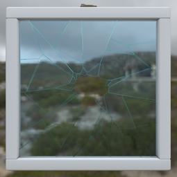
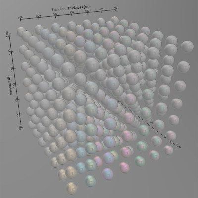
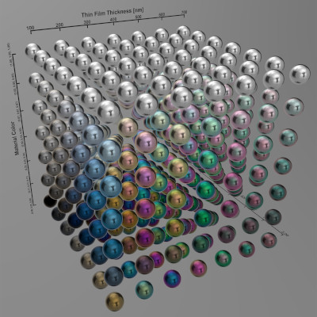
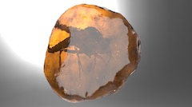
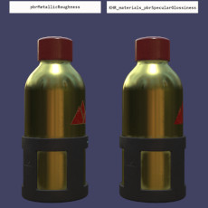
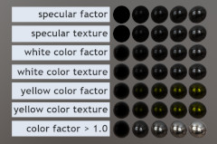

# glTF 2.0 Sample Models

## Models tagged with **extension**

Models that use one or more extensions.

## Other Tagged Listings

* [#all](Models.md) - All models listed alphabetically.
* [#core](Models-core.md) - Models that only use the core glTF V2.0 features and capabilities.
* [#extension](Models-extension.md) - Models that use one or more extensions.
* [#issues](Models-issues.md) - Models with one or more issues with respect to ownership or license.
* [#showcase](Models-showcase.md) - Models that are featured in some glTF/Khronos publicity.
* [#testing](Models-testing.md) - Models that are used for testing various features or capabilities of importers, viewers, or converters.
* [#video](Models-video.md) - Models used in any glTF video tutorial.
* [#written](Models-written.md) - Models used in any written glTF tutorial or guide.

| Model   | Description |
|---------|-------------|
| [A Beautiful Game](./2.0/ABeautifulGame/README.md)  [Show](https://github.khronos.org/glTF-Sample-Viewer-Release/?model=https://raw.GithubUserContent.com/DRx3D/glTF-Sample-Models/main/./2.0/ABeautifulGame/glTF/ABeautifulGame.gltf) | Chess set using transmission and volume. Credit: &copy; 2020, ASWF. [CC BY 4.0 International](https://creativecommons.org/licenses/by/4.0/legalcode)  - MaterialX Project for Original model &copy; 2022, Ed Mackey. [CC BY 4.0 International](https://creativecommons.org/licenses/by/4.0/legalcode)  - Ed Mackey for Conversion to glTF |
| [Attenuation Test](./2.0/AttenuationTest/README.md)  [Show](https://github.khronos.org/glTF-Sample-Viewer-Release/?model=https://raw.GithubUserContent.com/DRx3D/glTF-Sample-Models/main/./2.0/AttenuationTest/glTF-Binary/AttenuationTest.glb) -- [Download GLB](https://raw.GithubUserContent.com/DRx3D/glTF-Sample-Models/main/./2.0/AttenuationTest/glTF-Binary/AttenuationTest.glb) | Tests the interactions between attenuation, thickness, and scale. Credit: &copy; 2021, Analytical Graphics, Inc.. [CC BY 4.0 International](https://creativecommons.org/licenses/by/4.0/legalcode)  - Ed Mackey for Everything |
| [KHR_materials_clearcoat Test](./2.0/ClearCoatTest/README.md)  [Show](https://github.khronos.org/glTF-Sample-Viewer-Release/?model=https://raw.GithubUserContent.com/DRx3D/glTF-Sample-Models/main/./2.0/ClearCoatTest/glTF-Binary/ClearCoatTest.glb) -- [Download GLB](https://raw.GithubUserContent.com/DRx3D/glTF-Sample-Models/main/./2.0/ClearCoatTest/glTF-Binary/ClearCoatTest.glb) | Tests if the KHR_materials_clearcoat extension is supported properly. Credit: &copy; 2020, Analytical Graphics, Inc.. [CC BY 4.0 International](https://creativecommons.org/licenses/by/4.0/legalcode)  - Ed Mackey for Everything |
| [Dragon Attenuation](./2.0/DragonAttenuation/README.md)  [Show](https://github.khronos.org/glTF-Sample-Viewer-Release/?model=https://raw.GithubUserContent.com/DRx3D/glTF-Sample-Models/main/./2.0/DragonAttenuation/glTF-Binary/DragonAttenuation.glb) -- [Download GLB](https://raw.GithubUserContent.com/DRx3D/glTF-Sample-Models/main/./2.0/DragonAttenuation/glTF-Binary/DragonAttenuation.glb) | Dragon with background, using material variants, transmission, and volume. Credit: &copy; 1996, Stanford University Computer Graphics Laboratory. [Stanford Graphics Library](https://graphics.stanford.edu/data/3Dscanrep/)  - Stanford University Computer Graphics Laboratory for Original dragon model &copy; 2017, Morgan McGuire. [Stanford Graphics Library](https://graphics.stanford.edu/data/3Dscanrep/)  - Morgan McGuire's Computer Graphics Archive for Conversion and clean up &copy; 2021, Public. [CC0 1.0 Universal](https://creativecommons.org/publicdomain/zero/1.0/legalcode)  - Adobe for Cloth backdrop |
| [Emissive Strength Test](./2.0/EmissiveStrengthTest/README.md)  [Show](https://github.khronos.org/glTF-Sample-Viewer-Release/?model=https://raw.GithubUserContent.com/DRx3D/glTF-Sample-Models/main/./2.0/EmissiveStrengthTest/glTF-Binary/EmissiveStrengthTest.glb) -- [Download GLB](https://raw.GithubUserContent.com/DRx3D/glTF-Sample-Models/main/./2.0/EmissiveStrengthTest/glTF-Binary/EmissiveStrengthTest.glb) | Tests if the KHR_materials_emissive_strength extension is supported properly. Credit: &copy; 2022, AGI. [CC BY 4.0 International](https://creativecommons.org/licenses/by/4.0/legalcode)  - Ed Mackey for Everything |
| [Environment Test](./2.0/EnvironmentTest/README.md)  [Show](https://github.khronos.org/glTF-Sample-Viewer-Release/?model=https://raw.GithubUserContent.com/DRx3D/glTF-Sample-Models/main/./2.0/EnvironmentTest/glTF/EnvironmentTest.gltf) | A simple scene with metal and dielectric spheres that range between 0 and 1 roughness. Useful for testing environment lighting. Credit: &copy; 2017, Adobe. [Adobe Stock License](https://stock.adobe.com/license-terms?prev_url=detail&comparison-full#enhanced-license-terms)  - Adobe for Everything |
| [GlamVelvetSofa](./2.0/GlamVelvetSofa/README.md)  [Show](https://github.khronos.org/glTF-Sample-Viewer-Release/?model=https://raw.GithubUserContent.com/DRx3D/glTF-Sample-Models/main/./2.0/GlamVelvetSofa/glTF-Binary/GlamVelvetSofa.glb) -- [Download GLB](https://raw.GithubUserContent.com/DRx3D/glTF-Sample-Models/main/./2.0/GlamVelvetSofa/glTF-Binary/GlamVelvetSofa.glb) | Sofa using material variants, sheen, and specular. Credit: &copy; 2021, Wayfair, LLC. [CC BY 4.0 International](https://creativecommons.org/licenses/by/4.0/legalcode)  - Eric Chadwick for Everything |
| [Glass Broken Window](./2.0/GlassBrokenWindow/README.md)  [Show](https://github.khronos.org/glTF-Sample-Viewer-Release/?model=https://raw.GithubUserContent.com/DRx3D/glTF-Sample-Models/main/./2.0/GlassBrokenWindow/glTF-Binary/GlassBrokenWindow.glb) -- [Download GLB](https://raw.GithubUserContent.com/DRx3D/glTF-Sample-Models/main/./2.0/GlassBrokenWindow/glTF-Binary/GlassBrokenWindow.glb) | This asset demonstrates the combination of two transparency methods in glTF: KHR_materials_transmission for glass and alphaMode:'MASK' for holes in the broken glass. Credit: &copy; 2023, Wayfair. [CC BY 4.0 International](https://creativecommons.org/licenses/by/4.0/legalcode)  - Eric Chadwick for Entire asset |
| [Glass Hurricane Candle Holder](./2.0/GlassHurricaneCandleHolder/README.md)  [Show](https://github.khronos.org/glTF-Sample-Viewer-Release/?model=https://raw.GithubUserContent.com/DRx3D/glTF-Sample-Models/main/./2.0/GlassHurricaneCandleHolder/glTF-Binary/GlassHurricaneCandleHolder.glb) -- [Download GLB](https://raw.GithubUserContent.com/DRx3D/glTF-Sample-Models/main/./2.0/GlassHurricaneCandleHolder/glTF-Binary/GlassHurricaneCandleHolder.glb) | Glass holder using Materials Tranmission and Materials Volume extensions. Credit: &copy; 2021, Wayfair, LLC. [CC BY 4.0 International](https://creativecommons.org/licenses/by/4.0/legalcode)  - Eric Chadwick for Everything |
| [Glass Vase with Flowers](./2.0/GlassVaseFlowers/README.md)  [Show](https://github.khronos.org/glTF-Sample-Viewer-Release/?model=https://raw.GithubUserContent.com/DRx3D/glTF-Sample-Models/main/./2.0/GlassVaseFlowers/glTF-Binary/GlassVaseFlowers.glb) -- [Download GLB](https://raw.GithubUserContent.com/DRx3D/glTF-Sample-Models/main/./2.0/GlassVaseFlowers/glTF-Binary/GlassVaseFlowers.glb) | This model compares transparency methods for representing glass in glTF: alphaMode:'BLEND' (left) versus the extensions KHR_materials_transmission and KHR_materials_volume (right). Credit: &copy; 2023, Public. [CC0 1.0 Universal](https://creativecommons.org/publicdomain/zero/1.0/legalcode)  - Eric Chadwick for Glass vase &copy; 2023, Public. [CC0 1.0 Universal](https://creativecommons.org/publicdomain/zero/1.0/legalcode)  - Rico Cilliers for Flowers |
| [Iridescence Dielectric Spheres](./2.0/IridescenceDielectricSpheres/README.md)  [Show](https://github.khronos.org/glTF-Sample-Viewer-Release/?model=https://raw.GithubUserContent.com/DRx3D/glTF-Sample-Models/main/./2.0/IridescenceDielectricSpheres/glTF/IridescenceDielectricSpheres.gltf) | Tests KHR_materials_iridescence on a non-metallic material. Credit: &copy; 2019, Public. [CC0 1.0 Universal](https://creativecommons.org/publicdomain/zero/1.0/legalcode)  - Khronos for Everything |
| [Iridescence Lamp](./2.0/IridescenceLamp/README.md)  [Show](https://github.khronos.org/glTF-Sample-Viewer-Release/?model=https://raw.GithubUserContent.com/DRx3D/glTF-Sample-Models/main/./2.0/IridescenceLamp/glTF-Binary/IridescenceLamp.glb) -- [Download GLB](https://raw.GithubUserContent.com/DRx3D/glTF-Sample-Models/main/./2.0/IridescenceLamp/glTF-Binary/IridescenceLamp.glb) | Wayfair Lamp model using transmission, volume, and KHR_materials_iridescence. Credit: &copy; 2022, Wayfair, LLC. [CC BY 4.0 International](https://creativecommons.org/licenses/by/4.0/legalcode)  - Eric Chadwick for Everything |
| [Iridescence Metallic Spheres](./2.0/IridescenceMetallicSpheres/README.md)  [Show](https://github.khronos.org/glTF-Sample-Viewer-Release/?model=https://raw.GithubUserContent.com/DRx3D/glTF-Sample-Models/main/./2.0/IridescenceMetallicSpheres/glTF/IridescenceMetallicSpheres.gltf) | Tests KHR_materials_iridescence on a metallic material. Credit: &copy; 2022, UX3D. [CC0 1.0 Universal](https://creativecommons.org/publicdomain/zero/1.0/legalcode)  - UX3D for Everything |
| [Iridescence Suzanne](./2.0/IridescenceSuzanne/README.md)  [Show](https://github.khronos.org/glTF-Sample-Viewer-Release/?model=https://raw.GithubUserContent.com/DRx3D/glTF-Sample-Models/main/./2.0/IridescenceSuzanne/glTF-Binary/IridescenceSuzanne.glb) -- [Download GLB](https://raw.GithubUserContent.com/DRx3D/glTF-Sample-Models/main/./2.0/IridescenceSuzanne/glTF-Binary/IridescenceSuzanne.glb) | Further tests KHR_materials_iridescence. Credit: &copy; 2022, UX3D. [CC0 1.0 Universal](https://creativecommons.org/publicdomain/zero/1.0/legalcode)  - Mathias Kanzler for Initial version &copy; 2021, Pascal Schoen. [CC0 1.0 Universal](https://creativecommons.org/publicdomain/zero/1.0/legalcode)  - Pascal Schoen for Internal clean-up |
| [Iridescent Dish with Olives](./2.0/IridescentDishWithOlives/README.md)  [Show](https://github.khronos.org/glTF-Sample-Viewer-Release/?model=https://raw.GithubUserContent.com/DRx3D/glTF-Sample-Models/main/./2.0/IridescentDishWithOlives/glTF-Binary/IridescentDishWithOlives.glb) -- [Download GLB](https://raw.GithubUserContent.com/DRx3D/glTF-Sample-Models/main/./2.0/IridescentDishWithOlives/glTF-Binary/IridescentDishWithOlives.glb) | Dish using transmission, volume, IOR, and specular. Credit: &copy; 2020, Wayfair, LLC. [CC BY 4.0 International](https://creativecommons.org/licenses/by/4.0/legalcode)  - Eric Chadwick for Everything |
| [Lamp using KHR_lights_punctual Extension](./2.0/LightsPunctualLamp/README.md)  [Show](https://github.khronos.org/glTF-Sample-Viewer-Release/?model=https://raw.GithubUserContent.com/DRx3D/glTF-Sample-Models/main/./2.0/LightsPunctualLamp/glTF-Binary/LightsPunctualLamp.glb) -- [Download GLB](https://raw.GithubUserContent.com/DRx3D/glTF-Sample-Models/main/./2.0/LightsPunctualLamp/glTF-Binary/LightsPunctualLamp.glb) | Lamp using punctual lights. Credit: &copy; 2021, DGG. [CC BY 4.0 International](https://creativecommons.org/licenses/by/4.0/legalcode)  - DGG for Everything |
| [Mosquito In Amber](./2.0/MosquitoInAmber/README.md)  [Show](https://github.khronos.org/glTF-Sample-Viewer-Release/?model=https://raw.GithubUserContent.com/DRx3D/glTF-Sample-Models/main/./2.0/MosquitoInAmber/glTF-Binary/MosquitoInAmber.glb) -- [Download GLB](https://raw.GithubUserContent.com/DRx3D/glTF-Sample-Models/main/./2.0/MosquitoInAmber/glTF-Binary/MosquitoInAmber.glb) | Mosquito in amber by Sketchfab, using transmission, IOR, and volume. Credit: &copy; 2018, Sketchfab. [CC BY 4.0 International](https://creativecommons.org/licenses/by/4.0/legalcode)  - Loic Norgeot for Model &copy; 2019, Sketchfab. [CC BY 4.0 International](https://creativecommons.org/licenses/by/4.0/legalcode)  - Sketchfab for Real-time refraction |
| [SheenChair](./2.0/SheenChair/README.md)  [Show](https://github.khronos.org/glTF-Sample-Viewer-Release/?model=https://raw.GithubUserContent.com/DRx3D/glTF-Sample-Models/main/./2.0/SheenChair/glTF-Binary/SheenChair.glb) -- [Download GLB](https://raw.GithubUserContent.com/DRx3D/glTF-Sample-Models/main/./2.0/SheenChair/glTF-Binary/SheenChair.glb) | Chair using material variants and sheen. Credit: &copy; 2020, Wayfair, LLC. [CC0 1.0 Universal](https://creativecommons.org/publicdomain/zero/1.0/legalcode)  - Eric Chadwick for Everything |
| [Sheen Cloth](./2.0/SheenCloth/README.md)  [Show](https://github.khronos.org/glTF-Sample-Viewer-Release/?model=https://raw.GithubUserContent.com/DRx3D/glTF-Sample-Models/main/./2.0/SheenCloth/glTF/SheenCloth.gltf) | Fabric example using sheen. Credit: &copy; 2020, Microsoft. [CC0 1.0 Universal](https://creativecommons.org/publicdomain/zero/1.0/legalcode)  - Microsoft for Everything |
| [SpecGlossVsMetalRough](./2.0/SpecGlossVsMetalRough/README.md)  [Show](https://github.khronos.org/glTF-Sample-Viewer-Release/?model=https://raw.GithubUserContent.com/DRx3D/glTF-Sample-Models/main/./2.0/SpecGlossVsMetalRough/glTF-Binary/SpecGlossVsMetalRough.glb) -- [Download GLB](https://raw.GithubUserContent.com/DRx3D/glTF-Sample-Models/main/./2.0/SpecGlossVsMetalRough/glTF-Binary/SpecGlossVsMetalRough.glb) | Tests if the KHR_materials_pbrSpecularGlossiness extension is supported properly. Credit: &copy; 2017, Microsoft. [CC BY 4.0 International](https://creativecommons.org/licenses/by/4.0/legalcode)  - Microsoft for Everything |
| [Specular Test](./2.0/SpecularTest/README.md)  [Show](https://github.khronos.org/glTF-Sample-Viewer-Release/?model=https://raw.GithubUserContent.com/DRx3D/glTF-Sample-Models/main/./2.0/SpecularTest/glTF-Binary/SpecularTest.glb) -- [Download GLB](https://raw.GithubUserContent.com/DRx3D/glTF-Sample-Models/main/./2.0/SpecularTest/glTF-Binary/SpecularTest.glb) | Tests if the KHR_materials_specular extension is supported correctly. Credit: &copy; 2021, Analytical Graphics, Inc.. [CC BY 4.0 International](https://creativecommons.org/licenses/by/4.0/legalcode)  - Ed Mackey for Everything |
| [StainedGlassLamp](./2.0/StainedGlassLamp/README.md)  [Show](https://github.khronos.org/glTF-Sample-Viewer-Release/?model=https://raw.GithubUserContent.com/DRx3D/glTF-Sample-Models/main/./2.0/StainedGlassLamp/glTF/StainedGlassLamp.gltf) |   Credit: &copy; 2021, Wayfair. [CC BY 4.0 International](https://creativecommons.org/licenses/by/4.0/legalcode)  - Eric Chadwick for Everything |
| [Texture Transform Multi Test](./2.0/TextureTransformMultiTest/README.md)  [Show](https://github.khronos.org/glTF-Sample-Viewer-Release/?model=https://raw.GithubUserContent.com/DRx3D/glTF-Sample-Models/main/./2.0/TextureTransformMultiTest/glTF-Binary/TextureTransformMultiTest.glb) -- [Download GLB](https://raw.GithubUserContent.com/DRx3D/glTF-Sample-Models/main/./2.0/TextureTransformMultiTest/glTF-Binary/TextureTransformMultiTest.glb) | Tests if the KHR_texture_transform extension is supported for several inputs. Credit: &copy; 2020, Analytical Graphics, Inc.. [CC BY 4.0 International](https://creativecommons.org/licenses/by/4.0/legalcode)  - Ed Mackey for Everything |
| [Texture Transform Test](./2.0/TextureTransformTest/README.md)  [Show](https://github.khronos.org/glTF-Sample-Viewer-Release/?model=https://raw.GithubUserContent.com/DRx3D/glTF-Sample-Models/main/./2.0/TextureTransformTest/glTF/TextureTransformTest.gltf) | Tests if the KHR_texture_transform extension is supported for BaseColor. Credit: &copy; 2018, Microsoft. [CC0 1.0 Universal](https://creativecommons.org/publicdomain/zero/1.0/legalcode)  - Microsoft for Everything |
| [Toy Car](./2.0/ToyCar/README.md)  [Show](https://github.khronos.org/glTF-Sample-Viewer-Release/?model=https://raw.GithubUserContent.com/DRx3D/glTF-Sample-Models/main/./2.0/ToyCar/glTF-Binary/ToyCar.glb) -- [Download GLB](https://raw.GithubUserContent.com/DRx3D/glTF-Sample-Models/main/./2.0/ToyCar/glTF-Binary/ToyCar.glb) | Toy car example using transmission, clearcoat, and sheen. Credit: &copy; 2020, Public. [CC0 1.0 Universal](https://creativecommons.org/publicdomain/zero/1.0/legalcode)  - Guido Odendahl for Initial car model &copy; 2020, Public. [CC0 1.0 Universal](https://creativecommons.org/publicdomain/zero/1.0/legalcode)  - Eric Chadwick for Extensions and scene composition |
| [Transmission Roughness Test](./2.0/TransmissionRoughnessTest/README.md)  [Show](https://github.khronos.org/glTF-Sample-Viewer-Release/?model=https://raw.GithubUserContent.com/DRx3D/glTF-Sample-Models/main/./2.0/TransmissionRoughnessTest/glTF-Binary/TransmissionRoughnessTest.glb) -- [Download GLB](https://raw.GithubUserContent.com/DRx3D/glTF-Sample-Models/main/./2.0/TransmissionRoughnessTest/glTF-Binary/TransmissionRoughnessTest.glb) | Tests the interaction between roughness and IOR. Credit: &copy; 2021, Analytical Graphics, Inc.. [CC BY 4.0 International](https://creativecommons.org/licenses/by/4.0/legalcode)  - Ed Mackey for Everything |
| [Transmission Test](./2.0/TransmissionTest/README.md)  [Show](https://github.khronos.org/glTF-Sample-Viewer-Release/?model=https://raw.GithubUserContent.com/DRx3D/glTF-Sample-Models/main/./2.0/TransmissionTest/glTF-Binary/TransmissionTest.glb) -- [Download GLB](https://raw.GithubUserContent.com/DRx3D/glTF-Sample-Models/main/./2.0/TransmissionTest/glTF-Binary/TransmissionTest.glb) | Tests if the KHR_materials_transmission extension is supported properly. Credit: &copy; 2020, Public. [CC0 1.0 Universal](https://creativecommons.org/publicdomain/zero/1.0/legalcode)  - Adobe for Everything |
| [Unlit Test](./2.0/UnlitTest/README.md)  [Show](https://github.khronos.org/glTF-Sample-Viewer-Release/?model=https://raw.GithubUserContent.com/DRx3D/glTF-Sample-Models/main/./2.0/UnlitTest/glTF-Binary/UnlitTest.glb) -- [Download GLB](https://raw.GithubUserContent.com/DRx3D/glTF-Sample-Models/main/./2.0/UnlitTest/glTF-Binary/UnlitTest.glb) | Tests if the KHR_materials_unlit extension is supported properly. Credit: &copy; 2019, Analytical Graphics, Inc.. [CC BY 4.0 International](https://creativecommons.org/licenses/by/4.0/legalcode)  - Ed Mackey for Everything |
---

### Copyright

&copy; 2023, The Khronos Group.

**License:** [Creative Commons Attribtution 4.0 International](https://creativecommons.org/licenses/by/4.0/legalcode)

#### Generated by modelmetadata v0.22.30
