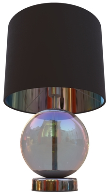

# glTF 2.0 Sample Assets

## Models tagged with **issues**

Models with one or more issues with respect to ownership, license, or markings.

## Other Tagged Listings

* [#all](Models.md) - All models listed alphabetically.
* [#core](Models-core.md) - Models that only use the core glTF V2.0 features and capabilities.
* [#extension](Models-extension.md) - Models that use one or more extensions.
* [#issues](Models-issues.md) - Models with one or more issues with respect to ownership, license, or markings.
* [#showcase](Models-showcase.md) - Models that are featured in some glTF/Khronos publicity.
* [#testing](Models-testing.md) - Models that are used for testing various features or capabilities of importers, viewers, or converters.
* [#video](Models-video.md) - Models used in any glTF video tutorial.
* [#written](Models-written.md) - Models used in any written glTF tutorial or guide.

| Model   | Description |
|---------|-------------|
| [Antique Camera](./Assets/AntiqueCamera/README.md)  [Show](https://github.khronos.org/glTF-Sample-Viewer-Release/?model=https://raw.GithubUserContent.com/DRx3D/glTF-Sample-Assets/main/./Assets/AntiqueCamera/glTF-Binary/AntiqueCamera.glb) -- [Download GLB](https://raw.GithubUserContent.com/DRx3D/glTF-Sample-Assets/main/./Assets/AntiqueCamera/glTF-Binary/AntiqueCamera.glb) | Static model of old camera on a tripod. [Issues: non-Khronos mark] Credit: &copy; 2018, UX3D. [CC0 1.0 Universal](https://creativecommons.org/publicdomain/zero/1.0/legalcode)  - Maximillan Kamps for Everything |
| [Box Textured](./Assets/BoxTextured/README.md)  [Show](https://github.khronos.org/glTF-Sample-Viewer-Release/?model=https://raw.GithubUserContent.com/DRx3D/glTF-Sample-Assets/main/./Assets/BoxTextured/glTF-Binary/BoxTextured.glb) -- [Download GLB](https://raw.GithubUserContent.com/DRx3D/glTF-Sample-Assets/main/./Assets/BoxTextured/glTF-Binary/BoxTextured.glb) | Box with a power-of-2 texture. [Issues: non-Khronos mark] Credit: &copy; 2017, Cesium. [CC-BY 4.0 International with Trademark Limitations]()  - Cesium for Everything |
| [Box Textured not 2^N](./Assets/BoxTexturedNonPowerOfTwo/README.md)  [Show](https://github.khronos.org/glTF-Sample-Viewer-Release/?model=https://raw.GithubUserContent.com/DRx3D/glTF-Sample-Assets/main/./Assets/BoxTexturedNonPowerOfTwo/glTF-Binary/BoxTexturedNonPowerOfTwo.glb) -- [Download GLB](https://raw.GithubUserContent.com/DRx3D/glTF-Sample-Assets/main/./Assets/BoxTexturedNonPowerOfTwo/glTF-Binary/BoxTexturedNonPowerOfTwo.glb) | Box with a non-power-of-2 (NPOT) texture. Not all implementations support NPOT textures. [Issues: non-Khronos mark] Credit: &copy; 2017, Cesium. [CC-BY 4.0 International with Trademark Limitations]()  - Cesium for Everything |
| [Box Vertex Colors](./Assets/BoxVertexColors/README.md)  [Show](https://github.khronos.org/glTF-Sample-Viewer-Release/?model=https://raw.GithubUserContent.com/DRx3D/glTF-Sample-Assets/main/./Assets/BoxVertexColors/glTF-Binary/BoxVertexColors.glb) -- [Download GLB](https://raw.GithubUserContent.com/DRx3D/glTF-Sample-Assets/main/./Assets/BoxVertexColors/glTF-Binary/BoxVertexColors.glb) | Box with vertex colors applied. [Issues: license] Credit: &copy; 2017, Michael Feldstein. [Assumed Khronos license, treat as TESTING only]()  - Michael Feldstein for Everything |
| [Cesium Man](./Assets/CesiumMan/README.md)  [Show](https://github.khronos.org/glTF-Sample-Viewer-Release/?model=https://raw.GithubUserContent.com/DRx3D/glTF-Sample-Assets/main/./Assets/CesiumMan/glTF-Binary/CesiumMan.glb) -- [Download GLB](https://raw.GithubUserContent.com/DRx3D/glTF-Sample-Assets/main/./Assets/CesiumMan/glTF-Binary/CesiumMan.glb) | Textured. Animations. Skins. [Issues: non-Khronos mark] Credit: &copy; 2017, Cesium. [CC-BY 4.0 International with Trademark Limitations]()  - Cesium for Everything |
| [Cesium Milk Truck](./Assets/CesiumMilkTruck/README.md)  [Show](https://github.khronos.org/glTF-Sample-Viewer-Release/?model=https://raw.GithubUserContent.com/DRx3D/glTF-Sample-Assets/main/./Assets/CesiumMilkTruck/glTF-Binary/CesiumMilkTruck.glb) -- [Download GLB](https://raw.GithubUserContent.com/DRx3D/glTF-Sample-Assets/main/./Assets/CesiumMilkTruck/glTF-Binary/CesiumMilkTruck.glb) | Textured. Multiple nodes/meshes. Animations. [Issues: non-Khronos mark] Credit: &copy; 2017, Cesium. [CC-BY 4.0 International with Trademark Limitations]()  - Cesium for Everything |
| [Iridescence Lamp](./Assets/IridescenceLamp/README.md)  [Show](https://github.khronos.org/glTF-Sample-Viewer-Release/?model=https://raw.GithubUserContent.com/DRx3D/glTF-Sample-Assets/main/./Assets/IridescenceLamp/glTF-Binary/IridescenceLamp.glb) -- [Download GLB](https://raw.GithubUserContent.com/DRx3D/glTF-Sample-Assets/main/./Assets/IridescenceLamp/glTF-Binary/IridescenceLamp.glb) | Wayfair Lamp model using transmission, volume, and KHR_materials_iridescence. [Issues: non-Khronos mark] Credit: &copy; 2022, Wayfair, LLC. [CC BY 4.0 International](https://creativecommons.org/licenses/by/4.0/legalcode)  - Eric Chadwick for Everything |
| [Iridescent Dish with Olives](./Assets/IridescentDishWithOlives/README.md)  [Show](https://github.khronos.org/glTF-Sample-Viewer-Release/?model=https://raw.GithubUserContent.com/DRx3D/glTF-Sample-Assets/main/./Assets/IridescentDishWithOlives/glTF-Binary/IridescentDishWithOlives.glb) -- [Download GLB](https://raw.GithubUserContent.com/DRx3D/glTF-Sample-Assets/main/./Assets/IridescentDishWithOlives/glTF-Binary/IridescentDishWithOlives.glb) | Dish using transmission, volume, IOR, and specular. [Issues: non-Khronos mark] Credit: &copy; 2020, Wayfair, LLC. [CC BY 4.0 International](https://creativecommons.org/licenses/by/4.0/legalcode)  - Eric Chadwick for Everything |
---

### Copyright

&copy; 2023, The Khronos Group.

**License:** [Creative Commons Attribtution 4.0 International](https://creativecommons.org/licenses/by/4.0/legalcode)

#### Generated by modelmetadata v1.0.2-alpha
