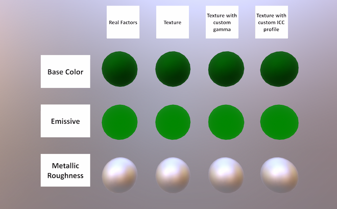

# glTF 2.0 Sample Models

## Models tagged with **issues**

Models with one or more issues with respect to ownership or license.

## Other Tagged Listings

* [#all](Models.md)
* [#core](Models-core.md)
* [#issues](Models-issues.md)
* [#showcase](Models-showcase.md)
* [#testing](Models-testing.md)
* [#video](Models-video.md)
* [#written](Models-written.md)

| Model   | Description |
|---------|-------------|
| [2 Cylinder Engine](./2.0/2CylinderEngine/README.md)  [Show](https://github.khronos.org/glTF-Sample-Viewer-Release/?model=https://raw.GithubUserContent.com/KhronosGroup/glTF-Sample-Models/master/./2.0/2CylinderEngine/glTF-Binary/2CylinderEngine.glb) -- [Download GLB](https://raw.GithubUserContent.com/KhronosGroup/glTF-Sample-Models/master/./2.0/2CylinderEngine/glTF-Binary/2CylinderEngine.glb) | Small CAD data set, including hierarchy. Credit: &copy; 2017, Unknown. [Khronos-Archive]()  - Khronos for Everything &copy; 2017, Unknown. [Khronos-Archive]()  - Okino for Conversion to glTF |
| [AnimatedTriangle](./2.0/AnimatedTriangle/README.md)  [Show](https://github.khronos.org/glTF-Sample-Viewer-Release/?model=https://raw.GithubUserContent.com/KhronosGroup/glTF-Sample-Models/master/./2.0/AnimatedTriangle/glTF/AnimatedTriangle.gltf) | This sample is similar to the Triangle, but the node has a rotation property that is modified with a simple animation Credit: &copy; 2017, Public. [CC0](https://creativecommons.org/publicdomain/zero/1.0/legalcode)  - Unknown for Everything |
| [Box Textured](./2.0/BoxTextured/README.md)  [Show](https://github.khronos.org/glTF-Sample-Viewer-Release/?model=https://raw.GithubUserContent.com/KhronosGroup/glTF-Sample-Models/master/./2.0/BoxTextured/glTF-Binary/BoxTextured.glb) -- [Download GLB](https://raw.GithubUserContent.com/KhronosGroup/glTF-Sample-Models/master/./2.0/BoxTextured/glTF-Binary/BoxTextured.glb) | Box with a power-of-2 texture. Credit: &copy; 2017, Cesium. [CC-BY 4.0 and TM]()  - Cesium for Everything |
| [Box Textured](./2.0/BoxTexturedNonPowerOfTwo/README.md)  [Show](https://github.khronos.org/glTF-Sample-Viewer-Release/?model=https://raw.GithubUserContent.com/KhronosGroup/glTF-Sample-Models/master/./2.0/BoxTexturedNonPowerOfTwo/glTF-Binary/BoxTexturedNonPowerOfTwo.glb) -- [Download GLB](https://raw.GithubUserContent.com/KhronosGroup/glTF-Sample-Models/master/./2.0/BoxTexturedNonPowerOfTwo/glTF-Binary/BoxTexturedNonPowerOfTwo.glb) | Box with a non-power-of-2 (NPOT) texture. Not all implementations support NPOT textures. Credit: &copy; 2017, Cesium. [CC-BY 4.0 and TM]()  - Cesium for Everything |
| [Box Vertex Colors](./2.0/BoxVertexColors/README.md)  [Show](https://github.khronos.org/glTF-Sample-Viewer-Release/?model=https://raw.GithubUserContent.com/KhronosGroup/glTF-Sample-Models/master/./2.0/BoxVertexColors/glTF-Binary/BoxVertexColors.glb) -- [Download GLB](https://raw.GithubUserContent.com/KhronosGroup/glTF-Sample-Models/master/./2.0/BoxVertexColors/glTF-Binary/BoxVertexColors.glb) | Box with vertex colors applied. Credit: &copy; 2017, Unknown. [Unknown]()  - Michael Feldstein for Everything |
| [Buggy](./2.0/Buggy/README.md)  [Show](https://github.khronos.org/glTF-Sample-Viewer-Release/?model=https://raw.GithubUserContent.com/KhronosGroup/glTF-Sample-Models/master/./2.0/Buggy/glTF-Binary/Buggy.glb) -- [Download GLB](https://raw.GithubUserContent.com/KhronosGroup/glTF-Sample-Models/master/./2.0/Buggy/glTF-Binary/Buggy.glb) | Medium-sized CAD data set, including hierarchy Credit: &copy; 2017, Unknown. [Khronos-Archive]()  - Khronos for Everything &copy; 2017, Unknown. [Khronos-Archive]()  - Okino for Conversion to glTF |
| [Cesium Man](./2.0/CesiumMan/README.md)  [Show](https://github.khronos.org/glTF-Sample-Viewer-Release/?model=https://raw.GithubUserContent.com/KhronosGroup/glTF-Sample-Models/master/./2.0/CesiumMan/glTF-Binary/CesiumMan.glb) -- [Download GLB](https://raw.GithubUserContent.com/KhronosGroup/glTF-Sample-Models/master/./2.0/CesiumMan/glTF-Binary/CesiumMan.glb) | Textured. Animations. Skins. Credit: &copy; 0000, Cesium. [CC-BY 4.0 and TM]()  - Cesium for Everything |
| [Cesium Milk Truck](./2.0/CesiumMilkTruck/README.md)  [Show](https://github.khronos.org/glTF-Sample-Viewer-Release/?model=https://raw.GithubUserContent.com/KhronosGroup/glTF-Sample-Models/master/./2.0/CesiumMilkTruck/glTF-Binary/CesiumMilkTruck.glb) -- [Download GLB](https://raw.GithubUserContent.com/KhronosGroup/glTF-Sample-Models/master/./2.0/CesiumMilkTruck/glTF-Binary/CesiumMilkTruck.glb) | Textured. Multiple nodes/meshes. Animations. Credit: &copy; 0000, Cesium. [CC-BY 4.0 and TM]()  - Cesium for Everything |
| [Duck](./2.0/Duck/README.md)  [Show](https://github.khronos.org/glTF-Sample-Viewer-Release/?model=https://raw.GithubUserContent.com/KhronosGroup/glTF-Sample-Models/master/./2.0/Duck/glTF-Binary/Duck.glb) -- [Download GLB](https://raw.GithubUserContent.com/KhronosGroup/glTF-Sample-Models/master/./2.0/Duck/glTF-Binary/Duck.glb) | The COLLADA duck. One texture. Credit: &copy; 2006, Sony. [SCEA Shared Source License, Version 1.0](https://web.archive.org/web/20160320123355/http://research.scea.com/scea_shared_source_license.html)  - Sony for Everything |
| [Gearbox Assy](./2.0/GearboxAssy/README.md)  [Show](https://github.khronos.org/glTF-Sample-Viewer-Release/?model=https://raw.GithubUserContent.com/KhronosGroup/glTF-Sample-Models/master/./2.0/GearboxAssy/glTF-Binary/GearboxAssy.glb) -- [Download GLB](https://raw.GithubUserContent.com/KhronosGroup/glTF-Sample-Models/master/./2.0/GearboxAssy/glTF-Binary/GearboxAssy.glb) | Medium-sized CAD data set, including hierarchy. Credit: &copy; 2017, Unknown. [Unknown]()  - Khronos for Everything &copy; 2017, Unknown. [Khronos-Archive]()  - Okino for Conversion to glTF |
| [Reciprocating Saw](./2.0/ReciprocatingSaw/README.md)  [Show](https://github.khronos.org/glTF-Sample-Viewer-Release/?model=https://raw.GithubUserContent.com/KhronosGroup/glTF-Sample-Models/master/./2.0/ReciprocatingSaw/glTF-Binary/ReciprocatingSaw.glb) -- [Download GLB](https://raw.GithubUserContent.com/KhronosGroup/glTF-Sample-Models/master/./2.0/ReciprocatingSaw/glTF-Binary/ReciprocatingSaw.glb) | Small CAD data set, including hierarchy. Credit: &copy; 2021, SharpGLTF. [CC-BY 4.0](https://creativecommons.org/licenses/by-nd/4.0/legalcode)  - SharpGLTF for Everything &copy; 2017, Unknown. [Khronos-Archive]()  - Okino for Conversion to glTF |
| [Texture Encoding Test](./2.0/TextureEncodingTest/README.md)  [Show](https://github.khronos.org/glTF-Sample-Viewer-Release/?model=https://raw.GithubUserContent.com/KhronosGroup/glTF-Sample-Models/master/./2.0/TextureEncodingTest/glTF-Binary/TextureEncodingTest.glb) -- [Download GLB](https://raw.GithubUserContent.com/KhronosGroup/glTF-Sample-Models/master/./2.0/TextureEncodingTest/glTF-Binary/TextureEncodingTest.glb) |   Credit: &copy; 2017, Public. [CC0](https://creativecommons.org/publicdomain/zero/1.0/legalcode)  - Khronos for Everything |
---

### Copyright

&copy; 2023, The Khronos Group.

**License:** [Creative Commons Attribtution 4.0 International](https://creativecommons.org/licenses/by/4.0/legalcode)

#### Generated by modelmetadata v0.16.9
