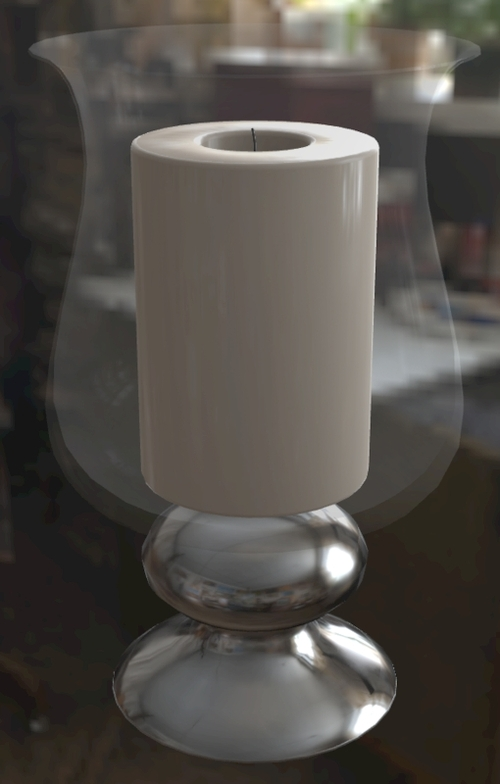

# glTF 2.0 Sample Models

## Models tagged with **showcase**

Models that are featured in some glTF/Khronos publicity.

## Other Tagged Listings

* [#all](Models.md) - All models listed alphabetically.
* [#core](Models-core.md) - Models that only use the core glTF V2.0 features and capabilities.
* [#extension](Models-extension.md) - Models that use one or more extensions.
* [#issues](Models-issues.md) - Models with one or more issues with respect to ownership or license.
* [#showcase](Models-showcase.md) - Models that are featured in some glTF/Khronos publicity.
* [#testing](Models-testing.md) - Models that are used for testing various features or capabilities of importers, viewers, or converters.
* [#video](Models-video.md) - Models used in any glTF video tutorial.
* [#written](Models-written.md) - Models used in any written glTF tutorial or guide.

| Model   | Description |
|---------|-------------|
| [A Beautiful Game](./2.0/ABeautifulGame/README.md)  [Show](https://github.khronos.org/glTF-Sample-Viewer-Release/?model=https://raw.GithubUserContent.com/DRx3D/glTF-Sample-Models/main/./2.0/ABeautifulGame/glTF/ABeautifulGame.gltf) | Chess set using transmission and volume. Credit: &copy; 2020, ASWF. [CC BY 4.0 International](https://creativecommons.org/licenses/by/4.0/legalcode)  - MaterialX Project for Original model &copy; 2022, Ed Mackey. [CC BY 4.0 International](https://creativecommons.org/licenses/by/4.0/legalcode)  - Ed Mackey for Conversion to glTF |
| [Damaged Helmet](./2.0/DamagedHelmet/README.md)  [Show](https://github.khronos.org/glTF-Sample-Viewer-Release/?model=https://raw.GithubUserContent.com/DRx3D/glTF-Sample-Models/main/./2.0/DamagedHelmet/glTF-Binary/DamagedHelmet.glb) -- [Download GLB](https://raw.GithubUserContent.com/DRx3D/glTF-Sample-Models/main/./2.0/DamagedHelmet/glTF-Binary/DamagedHelmet.glb) | Flight helmet with damage Credit: &copy; 2018, ctxwing. [CC BY 4.0 International](https://creativecommons.org/licenses/by/4.0/legalcode)  - ctxwing for Rebuild and conversion to glTF &copy; 2016, theblueturtle_. [CC BY-NC 4.0 International](https://creativecommons.org/licenses/by-nc/4.0/legalcode)  - theblueturtle_ for Earlier version of model |
| [Dragon Attenuation](./2.0/DragonAttenuation/README.md)  [Show](https://github.khronos.org/glTF-Sample-Viewer-Release/?model=https://raw.GithubUserContent.com/DRx3D/glTF-Sample-Models/main/./2.0/DragonAttenuation/glTF-Binary/DragonAttenuation.glb) -- [Download GLB](https://raw.GithubUserContent.com/DRx3D/glTF-Sample-Models/main/./2.0/DragonAttenuation/glTF-Binary/DragonAttenuation.glb) | Dragon with background, using material variants, transmission, and volume. Credit: &copy; 1996, Stanford University Computer Graphics Laboratory. [Stanford Graphics Library](https://graphics.stanford.edu/data/3Dscanrep/)  - Stanford University Computer Graphics Laboratory for Original dragon model &copy; 2017, Morgan McGuire. [Stanford Graphics Library](https://graphics.stanford.edu/data/3Dscanrep/)  - Morgan McGuire's Computer Graphics Archive for Conversion and clean up &copy; 2021, Public. [CC0 1.0 Universal](https://creativecommons.org/publicdomain/zero/1.0/legalcode)  - Adobe for Cloth backdrop |
| [Flight Helmet](./2.0/FlightHelmet/README.md)  [Show](https://github.khronos.org/glTF-Sample-Viewer-Release/?model=https://raw.GithubUserContent.com/DRx3D/glTF-Sample-Models/main/./2.0/FlightHelmet/glTF/FlightHelmet.gltf) |   Credit: &copy; 2018, Public. [CC0 1.0 Universal](https://creativecommons.org/publicdomain/zero/1.0/legalcode)  - Gary Hsu for Conversion from Maya |
| [Glass Hurricane Candle Holder](./2.0/GlassHurricaneCandleHolder/README.md)  [Show](https://github.khronos.org/glTF-Sample-Viewer-Release/?model=https://raw.GithubUserContent.com/DRx3D/glTF-Sample-Models/main/./2.0/GlassHurricaneCandleHolder/glTF-Binary/GlassHurricaneCandleHolder.glb) -- [Download GLB](https://raw.GithubUserContent.com/DRx3D/glTF-Sample-Models/main/./2.0/GlassHurricaneCandleHolder/glTF-Binary/GlassHurricaneCandleHolder.glb) | Glass holder using Materials Tranmission and Materials Volume extensions. Credit: &copy; 2021, Wayfair, LLC. [CC BY 4.0 International](https://creativecommons.org/licenses/by/4.0/legalcode)  - Eric Chadwick for Everything |
| [Iridescence Lamp](./2.0/IridescenceLamp/README.md)  [Show](https://github.khronos.org/glTF-Sample-Viewer-Release/?model=https://raw.GithubUserContent.com/DRx3D/glTF-Sample-Models/main/./2.0/IridescenceLamp/glTF-Binary/IridescenceLamp.glb) -- [Download GLB](https://raw.GithubUserContent.com/DRx3D/glTF-Sample-Models/main/./2.0/IridescenceLamp/glTF-Binary/IridescenceLamp.glb) | Wayfair Lamp model using transmission, volume, and KHR_materials_iridescence. Credit: &copy; 2022, Wayfair, LLC. [CC BY 4.0 International](https://creativecommons.org/licenses/by/4.0/legalcode)  - Eric Chadwick for Everything |
| [Iridescent Dish with Olives](./2.0/IridescentDishWithOlives/README.md)  [Show](https://github.khronos.org/glTF-Sample-Viewer-Release/?model=https://raw.GithubUserContent.com/DRx3D/glTF-Sample-Models/main/./2.0/IridescentDishWithOlives/glTF-Binary/IridescentDishWithOlives.glb) -- [Download GLB](https://raw.GithubUserContent.com/DRx3D/glTF-Sample-Models/main/./2.0/IridescentDishWithOlives/glTF-Binary/IridescentDishWithOlives.glb) | Dish using transmission, volume, IOR, and specular. Credit: &copy; 2020, Wayfair, LLC. [CC BY 4.0 International](https://creativecommons.org/licenses/by/4.0/legalcode)  - Eric Chadwick for Everything |
| [Mosquito In Amber](./2.0/MosquitoInAmber/README.md)  [Show](https://github.khronos.org/glTF-Sample-Viewer-Release/?model=https://raw.GithubUserContent.com/DRx3D/glTF-Sample-Models/main/./2.0/MosquitoInAmber/glTF-Binary/MosquitoInAmber.glb) -- [Download GLB](https://raw.GithubUserContent.com/DRx3D/glTF-Sample-Models/main/./2.0/MosquitoInAmber/glTF-Binary/MosquitoInAmber.glb) | Mosquito in amber by Sketchfab, using transmission, IOR, and volume. Credit: &copy; 2018, Sketchfab. [CC BY 4.0 International](https://creativecommons.org/licenses/by/4.0/legalcode)  - Loic Norgeot for Model &copy; 2019, Sketchfab. [CC BY 4.0 International](https://creativecommons.org/licenses/by/4.0/legalcode)  - Sketchfab for Real-time refraction |
| [SheenChair](./2.0/SheenChair/README.md)  [Show](https://github.khronos.org/glTF-Sample-Viewer-Release/?model=https://raw.GithubUserContent.com/DRx3D/glTF-Sample-Models/main/./2.0/SheenChair/glTF-Binary/SheenChair.glb) -- [Download GLB](https://raw.GithubUserContent.com/DRx3D/glTF-Sample-Models/main/./2.0/SheenChair/glTF-Binary/SheenChair.glb) | Chair using material variants and sheen. Credit: &copy; 2020, Wayfair, LLC. [CC0 1.0 Universal](https://creativecommons.org/publicdomain/zero/1.0/legalcode)  - Eric Chadwick for Everything |
| [Sheen Cloth](./2.0/SheenCloth/README.md)  [Show](https://github.khronos.org/glTF-Sample-Viewer-Release/?model=https://raw.GithubUserContent.com/DRx3D/glTF-Sample-Models/main/./2.0/SheenCloth/glTF/SheenCloth.gltf) | Fabric example using sheen. Credit: &copy; 2020, Microsoft. [CC0 1.0 Universal](https://creativecommons.org/publicdomain/zero/1.0/legalcode)  - Microsoft for Everything |
| [StainedGlassLamp](./2.0/StainedGlassLamp/README.md)  [Show](https://github.khronos.org/glTF-Sample-Viewer-Release/?model=https://raw.GithubUserContent.com/DRx3D/glTF-Sample-Models/main/./2.0/StainedGlassLamp/glTF/StainedGlassLamp.gltf) |   Credit: &copy; 2021, Wayfair. [CC BY 4.0 International](https://creativecommons.org/licenses/by/4.0/legalcode)  - Eric Chadwick for Everything |
| [Toy Car](./2.0/ToyCar/README.md)  [Show](https://github.khronos.org/glTF-Sample-Viewer-Release/?model=https://raw.GithubUserContent.com/DRx3D/glTF-Sample-Models/main/./2.0/ToyCar/glTF-Binary/ToyCar.glb) -- [Download GLB](https://raw.GithubUserContent.com/DRx3D/glTF-Sample-Models/main/./2.0/ToyCar/glTF-Binary/ToyCar.glb) | Toy car example using transmission, clearcoat, and sheen. Credit: &copy; 2020, Public. [CC0 1.0 Universal](https://creativecommons.org/publicdomain/zero/1.0/legalcode)  - Guido Odendahl for Initial car model &copy; 2020, Public. [CC0 1.0 Universal](https://creativecommons.org/publicdomain/zero/1.0/legalcode)  - Eric Chadwick for Extensions and scene composition |
---

### Copyright

&copy; 2023, The Khronos Group.

**License:** [Creative Commons Attribtution 4.0 International](https://creativecommons.org/licenses/by/4.0/legalcode)

#### Generated by modelmetadata v0.21.28
