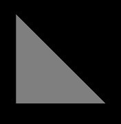

# glTF 2.0 Sample Models

## Models tagged with **written**

Models used in any written glTF tutorial or guide.

## Other Tagged Listings

* [#all](Models.md)
* [#core](Models-core.md)
* [#issues](Models-issues.md)
* [#showcase](Models-showcase.md)
* [#testing](Models-testing.md)
* [#video](Models-video.md)
* [#written](Models-written.md)

| Model   | Description |
|---------|-------------|
| [AnimatedTriangle](./2.0/AnimatedTriangle/README.md)  [Show](https://github.khronos.org/glTF-Sample-Viewer-Release/?model=https://raw.GithubUserContent.com/KhronosGroup/glTF-Sample-Models/master/./2.0/AnimatedTriangle/glTF/AnimatedTriangle.gltf) | This sample is similar to the Triangle, but the node has a rotation property that is modified with a simple animation Credit: &copy; 2017, Public. [CC0](https://creativecommons.org/publicdomain/zero/1.0/legalcode)  - Unknown for Everything |
| [SimpleMeshes](./2.0/SimpleMeshes/README.md)  [Show](https://github.khronos.org/glTF-Sample-Viewer-Release/?model=https://raw.GithubUserContent.com/KhronosGroup/glTF-Sample-Models/master/./2.0/SimpleMeshes/glTF/SimpleMeshes.gltf) | A simple scene with two nodes, both containing the same mesh, namely a mesh with a single mesh.primitive with a single indexed triangle with multiple attributes (positions, normals and texture coordinates), but without a material Credit: &copy; 2017, Public. [CC0](https://creativecommons.org/publicdomain/zero/1.0/legalcode)  - Khronos for Everything |
| [SimpleSkin](./2.0/SimpleSkin/README.md)  [Show](https://github.khronos.org/glTF-Sample-Viewer-Release/?model=https://raw.GithubUserContent.com/KhronosGroup/glTF-Sample-Models/master/./2.0/SimpleSkin/glTF/SimpleSkin.gltf) | A simple example of vertex skinning in glTF Credit: &copy; 2017, Public. [CC0](https://creativecommons.org/publicdomain/zero/1.0/legalcode)  - Khronos for Everything |
| [Triangle](./2.0/Triangle/README.md)  [Show](https://github.khronos.org/glTF-Sample-Viewer-Release/?model=https://raw.GithubUserContent.com/KhronosGroup/glTF-Sample-Models/master/./2.0/Triangle/glTF/Triangle.gltf) | A very simple glTF asset: The basic structure is the same as in Triangle Without Indices, but here, the mesh.primitive describes an indexed geometry Credit: &copy; 2017, Public. [CC0](https://creativecommons.org/publicdomain/zero/1.0/legalcode)  - Khronos for Everything |
| [Water Bottle](./2.0/WaterBottle/README.md)  [Show](https://github.khronos.org/glTF-Sample-Viewer-Release/?model=https://raw.GithubUserContent.com/KhronosGroup/glTF-Sample-Models/master/./2.0/WaterBottle/glTF-Binary/WaterBottle.glb) -- [Download GLB](https://raw.GithubUserContent.com/KhronosGroup/glTF-Sample-Models/master/./2.0/WaterBottle/glTF-Binary/WaterBottle.glb) | _No Summary_ Credit: &copy; 2017, Public. [CC0](https://creativecommons.org/publicdomain/zero/1.0/legalcode)  - Microsoft for Everything |
---

### Copyright

&copy; 2023, The Khronos Group.

**License:** [Creative Commons Attribtution 4.0 International](https://creativecommons.org/licenses/by/4.0/legalcode)

#### Generated by modelmetadata v0.16.9
