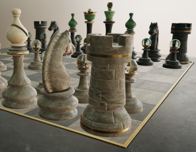
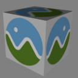
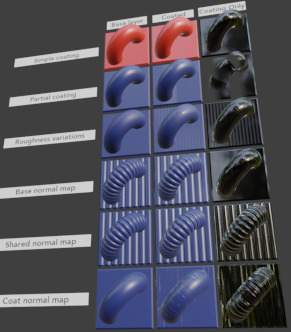
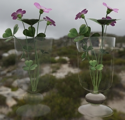
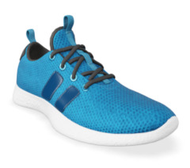
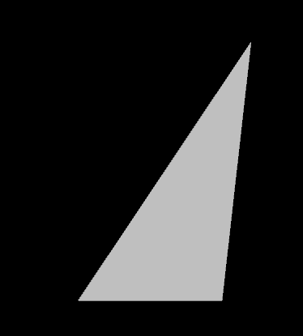
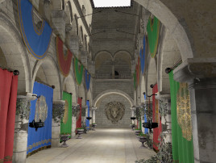
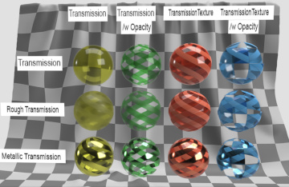
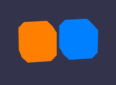

# glTF 2.0 Sample Assets

## All models

All models listed alphabetically.

## Other Tagged Listings

* [#all](Models.md) - All models listed alphabetically.
* [#core](Models-core.md) - Models that only use the core glTF V2.0 features and capabilities.
* [#extension](Models-extension.md) - Models that use one or more extensions.
* [#issues](Models-issues.md) - Models with one or more issues with respect to ownership, license, or markings.
* [#showcase](Models-showcase.md) - Models that are featured in some glTF/Khronos publicity.
* [#testing](Models-testing.md) - Models that are used for testing various features or capabilities of importers, viewers, or converters.
* [#video](Models-video.md) - Models used in any glTF video tutorial.
* [#written](Models-written.md) - Models used in any written glTF tutorial or guide.

| Model   | Description |
|---------|-------------|
| [A Beautiful Game](./Assets/ABeautifulGame/README.md)  [Show](https://github.khronos.org/glTF-Sample-Viewer-Release/?model=https://raw.GithubUserContent.com/DRx3D/glTF-Sample-Assets/main/./Assets/ABeautifulGame/glTF/ABeautifulGame.gltf) | Chess set using transmission and volume. Credit: &copy; 2020, ASWF. [CC BY 4.0 International](https://creativecommons.org/licenses/by/4.0/legalcode)  - MaterialX Project for Original model &copy; 2022, Ed Mackey. [CC BY 4.0 International](https://creativecommons.org/licenses/by/4.0/legalcode)  - Ed Mackey for Conversion to glTF |
| [Alpha Blend Mode Test](./Assets/AlphaBlendModeTest/README.md)  [Show](https://github.khronos.org/glTF-Sample-Viewer-Release/?model=https://raw.GithubUserContent.com/DRx3D/glTF-Sample-Assets/main/./Assets/AlphaBlendModeTest/glTF-Binary/AlphaBlendModeTest.glb) -- [Download GLB](https://raw.GithubUserContent.com/DRx3D/glTF-Sample-Assets/main/./Assets/AlphaBlendModeTest/glTF-Binary/AlphaBlendModeTest.glb) | Tests alpha modes and settings. Credit: &copy; 2018, Analytical Graphics, Inc.. [CC BY 4.0 International](https://creativecommons.org/licenses/by/4.0/legalcode)  - Ed Mackey for Everything |
| [Animated Cube](./Assets/AnimatedCube/README.md)  [Show](https://github.khronos.org/glTF-Sample-Viewer-Release/?model=https://raw.GithubUserContent.com/DRx3D/glTF-Sample-Assets/main/./Assets/AnimatedCube/glTF/AnimatedCube.gltf) | Same as 'Cube', but having a linear rotation animation. Credit: &copy; 2017, UX3D. [CC0 1.0 Universal](https://creativecommons.org/publicdomain/zero/1.0/legalcode)  - Norbert Nopper for Everything |
| [Animated Morph Cube](./Assets/AnimatedMorphCube/README.md)  [Show](https://github.khronos.org/glTF-Sample-Viewer-Release/?model=https://raw.GithubUserContent.com/DRx3D/glTF-Sample-Assets/main/./Assets/AnimatedMorphCube/glTF-Binary/AnimatedMorphCube.glb) -- [Download GLB](https://raw.GithubUserContent.com/DRx3D/glTF-Sample-Assets/main/./Assets/AnimatedMorphCube/glTF-Binary/AnimatedMorphCube.glb) | Demonstrates a simple cube with two simple morph targets and an animation that transitions between them both. Credit: &copy; 2017, Public. [CC0 1.0 Universal](https://creativecommons.org/publicdomain/zero/1.0/legalcode)  - Microsoft for Everything |
| [Animated Morph Sphere](./Assets/AnimatedMorphSphere/README.md)  [Show](https://github.khronos.org/glTF-Sample-Viewer-Release/?model=https://raw.GithubUserContent.com/DRx3D/glTF-Sample-Assets/main/./Assets/AnimatedMorphSphere/glTF-Binary/AnimatedMorphSphere.glb) -- [Download GLB](https://raw.GithubUserContent.com/DRx3D/glTF-Sample-Assets/main/./Assets/AnimatedMorphSphere/glTF-Binary/AnimatedMorphSphere.glb) | This sample is similar to the Animated Morph Cube, but the two morph targets move many more vertices and are more extreme than with the cube. Credit: &copy; 2017, Public. [CC0 1.0 Universal](https://creativecommons.org/publicdomain/zero/1.0/legalcode)  - Microsoft for Everything |
| [AnimatedTriangle](./Assets/AnimatedTriangle/README.md)  [Show](https://github.khronos.org/glTF-Sample-Viewer-Release/?model=https://raw.GithubUserContent.com/DRx3D/glTF-Sample-Assets/main/./Assets/AnimatedTriangle/glTF/AnimatedTriangle.gltf) | This sample is similar to the Triangle, but the node has a rotation property that is modified with a simple animation Credit: &copy; 2017, Public. [CC0 1.0 Universal](https://creativecommons.org/publicdomain/zero/1.0/legalcode)  - javagl for Everything |
| [Antique Camera](./Assets/AntiqueCamera/README.md)  [Show](https://github.khronos.org/glTF-Sample-Viewer-Release/?model=https://raw.GithubUserContent.com/DRx3D/glTF-Sample-Assets/main/./Assets/AntiqueCamera/glTF-Binary/AntiqueCamera.glb) -- [Download GLB](https://raw.GithubUserContent.com/DRx3D/glTF-Sample-Assets/main/./Assets/AntiqueCamera/glTF-Binary/AntiqueCamera.glb) | Static model of old camera on a tripod. [Issues: non-Khronos mark] Credit: &copy; 2018, UX3D. [CC0 1.0 Universal](https://creativecommons.org/publicdomain/zero/1.0/legalcode)  - Maximillan Kamps for Everything |
| [Attenuation Test](./Assets/AttenuationTest/README.md)  [Show](https://github.khronos.org/glTF-Sample-Viewer-Release/?model=https://raw.GithubUserContent.com/DRx3D/glTF-Sample-Assets/main/./Assets/AttenuationTest/glTF-Binary/AttenuationTest.glb) -- [Download GLB](https://raw.GithubUserContent.com/DRx3D/glTF-Sample-Assets/main/./Assets/AttenuationTest/glTF-Binary/AttenuationTest.glb) | Tests the interactions between attenuation, thickness, and scale. Credit: &copy; 2021, Analytical Graphics, Inc.. [CC BY 4.0 International](https://creativecommons.org/licenses/by/4.0/legalcode)  - Ed Mackey for Everything |
| [Avocado](./Assets/Avocado/README.md)  [Show](https://github.khronos.org/glTF-Sample-Viewer-Release/?model=https://raw.GithubUserContent.com/DRx3D/glTF-Sample-Assets/main/./Assets/Avocado/glTF-Binary/Avocado.glb) -- [Download GLB](https://raw.GithubUserContent.com/DRx3D/glTF-Sample-Assets/main/./Assets/Avocado/glTF-Binary/Avocado.glb) |   Credit: &copy; 2017, Public. [CC0 1.0 Universal](https://creativecommons.org/publicdomain/zero/1.0/legalcode)  - Microsoft for Everything |
| [Barramundi Fish](./Assets/BarramundiFish/README.md)  [Show](https://github.khronos.org/glTF-Sample-Viewer-Release/?model=https://raw.GithubUserContent.com/DRx3D/glTF-Sample-Assets/main/./Assets/BarramundiFish/glTF-Binary/BarramundiFish.glb) -- [Download GLB](https://raw.GithubUserContent.com/DRx3D/glTF-Sample-Assets/main/./Assets/BarramundiFish/glTF-Binary/BarramundiFish.glb) |   Credit: &copy; 2017, Public. [CC0 1.0 Universal](https://creativecommons.org/publicdomain/zero/1.0/legalcode)  - Microsoft for Everything |
| [Boom Box](./Assets/BoomBox/README.md)  [Show](https://github.khronos.org/glTF-Sample-Viewer-Release/?model=https://raw.GithubUserContent.com/DRx3D/glTF-Sample-Assets/main/./Assets/BoomBox/glTF-Binary/BoomBox.glb) -- [Download GLB](https://raw.GithubUserContent.com/DRx3D/glTF-Sample-Assets/main/./Assets/BoomBox/glTF-Binary/BoomBox.glb) |   Credit: &copy; 2017, Public. [CC0 1.0 Universal](https://creativecommons.org/publicdomain/zero/1.0/legalcode)  - Microsoft for Everything |
| [Boom Box with Axes](./Assets/BoomBoxWithAxes/README.md)  [Show](https://github.khronos.org/glTF-Sample-Viewer-Release/?model=https://raw.GithubUserContent.com/DRx3D/glTF-Sample-Assets/main/./Assets/BoomBoxWithAxes/glTF/BoomBoxWithAxes.gltf) | Shows X, Y, and Z axis default orientations. Credit: &copy; 2018, Public. [CC0 1.0 Universal](https://creativecommons.org/publicdomain/zero/1.0/legalcode)  - Microsoft for Everything |
| [Box](./Assets/Box/README.md)  [Show](https://github.khronos.org/glTF-Sample-Viewer-Release/?model=https://raw.GithubUserContent.com/DRx3D/glTF-Sample-Assets/main/./Assets/Box/glTF-Binary/Box.glb) -- [Download GLB](https://raw.GithubUserContent.com/DRx3D/glTF-Sample-Assets/main/./Assets/Box/glTF-Binary/Box.glb) | One mesh and one material. Start with this. Credit: &copy; 2017, Cesium. [CC BY 4.0 International](https://creativecommons.org/licenses/by/4.0/legalcode)  - Cesium for Everything |
| [Box With Spaces](./Assets/Box%20With%20Spaces/README.md)  [Show](https://github.khronos.org/glTF-Sample-Viewer-Release/?model=https://raw.GithubUserContent.com/DRx3D/glTF-Sample-Assets/main/./Assets/Box%20With%20Spaces/glTF/Box%20With%20Spaces.gltf) | Box with URI-encoded spaces in the texture names used by a simple PBR material. Credit: &copy; 2017, Analytical Graphics, Inc.. [CC0 1.0 Universal](https://creativecommons.org/publicdomain/zero/1.0/legalcode)  - Ed Mackey for Everything |
| [Box Animated](./Assets/BoxAnimated/README.md)  [Show](https://github.khronos.org/glTF-Sample-Viewer-Release/?model=https://raw.GithubUserContent.com/DRx3D/glTF-Sample-Assets/main/./Assets/BoxAnimated/glTF-Binary/BoxAnimated.glb) -- [Download GLB](https://raw.GithubUserContent.com/DRx3D/glTF-Sample-Assets/main/./Assets/BoxAnimated/glTF-Binary/BoxAnimated.glb) | Rotation and Translation Animations. Start with this to test animations. Credit: &copy; 2017, Cesium. [CC BY 4.0 International](https://creativecommons.org/licenses/by/4.0/legalcode)  - Cesium for Everything |
| [Box with interleaved position and normal attributes](./Assets/BoxInterleaved/README.md)  [Show](https://github.khronos.org/glTF-Sample-Viewer-Release/?model=https://raw.GithubUserContent.com/DRx3D/glTF-Sample-Assets/main/./Assets/BoxInterleaved/glTF-Binary/BoxInterleaved.glb) -- [Download GLB](https://raw.GithubUserContent.com/DRx3D/glTF-Sample-Assets/main/./Assets/BoxInterleaved/glTF-Binary/BoxInterleaved.glb) | Box example with interleaved position and normal attributes. Credit: &copy; 2017, Cesium. [CC BY 4.0 International](https://creativecommons.org/licenses/by/4.0/legalcode)  - Cesium for Everything |
| [Box Textured](./Assets/BoxTextured/README.md)  [Show](https://github.khronos.org/glTF-Sample-Viewer-Release/?model=https://raw.GithubUserContent.com/DRx3D/glTF-Sample-Assets/main/./Assets/BoxTextured/glTF-Binary/BoxTextured.glb) -- [Download GLB](https://raw.GithubUserContent.com/DRx3D/glTF-Sample-Assets/main/./Assets/BoxTextured/glTF-Binary/BoxTextured.glb) | Box with a power-of-2 texture. [Issues: non-Khronos mark] Credit: &copy; 2017, Cesium. [CC-BY 4.0 International with Trademark Limitations]()  - Cesium for Everything |
| [Box Textured not 2^N](./Assets/BoxTexturedNonPowerOfTwo/README.md)  [Show](https://github.khronos.org/glTF-Sample-Viewer-Release/?model=https://raw.GithubUserContent.com/DRx3D/glTF-Sample-Assets/main/./Assets/BoxTexturedNonPowerOfTwo/glTF-Binary/BoxTexturedNonPowerOfTwo.glb) -- [Download GLB](https://raw.GithubUserContent.com/DRx3D/glTF-Sample-Assets/main/./Assets/BoxTexturedNonPowerOfTwo/glTF-Binary/BoxTexturedNonPowerOfTwo.glb) | Box with a non-power-of-2 (NPOT) texture. Not all implementations support NPOT textures. [Issues: non-Khronos mark] Credit: &copy; 2017, Cesium. [CC-BY 4.0 International with Trademark Limitations]()  - Cesium for Everything |
| [Box Vertex Colors](./Assets/BoxVertexColors/README.md)  [Show](https://github.khronos.org/glTF-Sample-Viewer-Release/?model=https://raw.GithubUserContent.com/DRx3D/glTF-Sample-Assets/main/./Assets/BoxVertexColors/glTF-Binary/BoxVertexColors.glb) -- [Download GLB](https://raw.GithubUserContent.com/DRx3D/glTF-Sample-Assets/main/./Assets/BoxVertexColors/glTF-Binary/BoxVertexColors.glb) | Box with vertex colors applied. [Issues: license] Credit: &copy; 2017, Michael Feldstein. [Assumed Khronos license, treat as TESTING only]()  - Michael Feldstein for Everything |
| [BrainStem](./Assets/BrainStem/README.md)  [Show](https://github.khronos.org/glTF-Sample-Viewer-Release/?model=https://raw.GithubUserContent.com/DRx3D/glTF-Sample-Assets/main/./Assets/BrainStem/glTF-Binary/BrainStem.glb) -- [Download GLB](https://raw.GithubUserContent.com/DRx3D/glTF-Sample-Assets/main/./Assets/BrainStem/glTF-Binary/BrainStem.glb) | Animations. Skins. Credit: &copy; 2017, Smith Micro Software, Inc.. [Poser EULA](https://archive.org/stream/poser-pro-2014-reference-manual/Poser_Pro_2014_reference_manual_djvu.txt)  - Keith Hunter for Everything |
| [Cameras](./Assets/Cameras/README.md)  [Show](https://github.khronos.org/glTF-Sample-Viewer-Release/?model=https://raw.GithubUserContent.com/DRx3D/glTF-Sample-Assets/main/./Assets/Cameras/glTF/Cameras.gltf) | A sample with two different camera objects Credit: &copy; 2017, Public. [CC0 1.0 Universal](https://creativecommons.org/publicdomain/zero/1.0/legalcode)  - javagl for Everything |
| [Cesium Man](./Assets/CesiumMan/README.md)  [Show](https://github.khronos.org/glTF-Sample-Viewer-Release/?model=https://raw.GithubUserContent.com/DRx3D/glTF-Sample-Assets/main/./Assets/CesiumMan/glTF-Binary/CesiumMan.glb) -- [Download GLB](https://raw.GithubUserContent.com/DRx3D/glTF-Sample-Assets/main/./Assets/CesiumMan/glTF-Binary/CesiumMan.glb) | Textured. Animations. Skins. [Issues: non-Khronos mark] Credit: &copy; 2017, Cesium. [CC-BY 4.0 International with Trademark Limitations]()  - Cesium for Everything |
| [Cesium Milk Truck](./Assets/CesiumMilkTruck/README.md)  [Show](https://github.khronos.org/glTF-Sample-Viewer-Release/?model=https://raw.GithubUserContent.com/DRx3D/glTF-Sample-Assets/main/./Assets/CesiumMilkTruck/glTF-Binary/CesiumMilkTruck.glb) -- [Download GLB](https://raw.GithubUserContent.com/DRx3D/glTF-Sample-Assets/main/./Assets/CesiumMilkTruck/glTF-Binary/CesiumMilkTruck.glb) | Textured. Multiple nodes/meshes. Animations. [Issues: non-Khronos mark] Credit: &copy; 2017, Cesium. [CC-BY 4.0 International with Trademark Limitations]()  - Cesium for Everything |
| [KHR_materials_clearcoat Test](./Assets/ClearCoatTest/README.md)  [Show](https://github.khronos.org/glTF-Sample-Viewer-Release/?model=https://raw.GithubUserContent.com/DRx3D/glTF-Sample-Assets/main/./Assets/ClearCoatTest/glTF-Binary/ClearCoatTest.glb) -- [Download GLB](https://raw.GithubUserContent.com/DRx3D/glTF-Sample-Assets/main/./Assets/ClearCoatTest/glTF-Binary/ClearCoatTest.glb) | Tests if the KHR_materials_clearcoat extension is supported properly. Credit: &copy; 2020, Analytical Graphics, Inc.. [CC BY 4.0 International](https://creativecommons.org/licenses/by/4.0/legalcode)  - Ed Mackey for Everything |
| [Corset](./Assets/Corset/README.md)  [Show](https://github.khronos.org/glTF-Sample-Viewer-Release/?model=https://raw.GithubUserContent.com/DRx3D/glTF-Sample-Assets/main/./Assets/Corset/glTF-Binary/Corset.glb) -- [Download GLB](https://raw.GithubUserContent.com/DRx3D/glTF-Sample-Assets/main/./Assets/Corset/glTF-Binary/Corset.glb) |   Credit: &copy; 2017, UX3D. [CC0 1.0 Universal](https://creativecommons.org/publicdomain/zero/1.0/legalcode)  - Microsoft for Everything |
| [Cube](./Assets/Cube/README.md)  [Show](https://github.khronos.org/glTF-Sample-Viewer-Release/?model=https://raw.GithubUserContent.com/DRx3D/glTF-Sample-Assets/main/./Assets/Cube/glTF/Cube.gltf) | A cube with non-smoothed faces. Credit: &copy; 2017, UX3D. [CC0 1.0 Universal](https://creativecommons.org/publicdomain/zero/1.0/legalcode)  - Norbert Nopper for Everything |
| [Damaged Helmet](./Assets/DamagedHelmet/README.md)  [Show](https://github.khronos.org/glTF-Sample-Viewer-Release/?model=https://raw.GithubUserContent.com/DRx3D/glTF-Sample-Assets/main/./Assets/DamagedHelmet/glTF-Binary/DamagedHelmet.glb) -- [Download GLB](https://raw.GithubUserContent.com/DRx3D/glTF-Sample-Assets/main/./Assets/DamagedHelmet/glTF-Binary/DamagedHelmet.glb) | Flight helmet with damage Credit: &copy; 2018, ctxwing. [CC BY 4.0 International](https://creativecommons.org/licenses/by/4.0/legalcode)  - ctxwing for Rebuild and conversion to glTF &copy; 2016, theblueturtle_. [CC BY-NC 4.0 International](https://creativecommons.org/licenses/by-nc/4.0/legalcode)  - theblueturtle_ for Earlier version of model |
| [Dragon Attenuation](./Assets/DragonAttenuation/README.md)  [Show](https://github.khronos.org/glTF-Sample-Viewer-Release/?model=https://raw.GithubUserContent.com/DRx3D/glTF-Sample-Assets/main/./Assets/DragonAttenuation/glTF-Binary/DragonAttenuation.glb) -- [Download GLB](https://raw.GithubUserContent.com/DRx3D/glTF-Sample-Assets/main/./Assets/DragonAttenuation/glTF-Binary/DragonAttenuation.glb) | Dragon with background, using material variants, transmission, and volume. Credit: &copy; 1996, Stanford University Computer Graphics Laboratory. [Stanford Graphics Library](https://graphics.stanford.edu/data/3Dscanrep/)  - Stanford University Computer Graphics Laboratory for Original dragon model &copy; 2017, Morgan McGuire. [Stanford Graphics Library](https://graphics.stanford.edu/data/3Dscanrep/)  - Morgan McGuire's Computer Graphics Archive for Conversion and clean up &copy; 2021, Public. [CC0 1.0 Universal](https://creativecommons.org/publicdomain/zero/1.0/legalcode)  - Adobe for Cloth backdrop |
| [Duck](./Assets/Duck/README.md)  [Show](https://github.khronos.org/glTF-Sample-Viewer-Release/?model=https://raw.GithubUserContent.com/DRx3D/glTF-Sample-Assets/main/./Assets/Duck/glTF-Binary/Duck.glb) -- [Download GLB](https://raw.GithubUserContent.com/DRx3D/glTF-Sample-Assets/main/./Assets/Duck/glTF-Binary/Duck.glb) | The COLLADA duck. One texture. Credit: &copy; 2006, Sony. [SCEA Shared Source License, Version 1.0](https://spdx.org/licenses/SCEA.html)  - Sony for Everything |
| [Emissive Strength Test](./Assets/EmissiveStrengthTest/README.md)  [Show](https://github.khronos.org/glTF-Sample-Viewer-Release/?model=https://raw.GithubUserContent.com/DRx3D/glTF-Sample-Assets/main/./Assets/EmissiveStrengthTest/glTF-Binary/EmissiveStrengthTest.glb) -- [Download GLB](https://raw.GithubUserContent.com/DRx3D/glTF-Sample-Assets/main/./Assets/EmissiveStrengthTest/glTF-Binary/EmissiveStrengthTest.glb) | Tests if the KHR_materials_emissive_strength extension is supported properly. Credit: &copy; 2022, AGI. [CC BY 4.0 International](https://creativecommons.org/licenses/by/4.0/legalcode)  - Ed Mackey for Everything |
| [Environment Test](./Assets/EnvironmentTest/README.md)  [Show](https://github.khronos.org/glTF-Sample-Viewer-Release/?model=https://raw.GithubUserContent.com/DRx3D/glTF-Sample-Assets/main/./Assets/EnvironmentTest/glTF/EnvironmentTest.gltf) | A simple scene with metal and dielectric spheres that range between 0 and 1 roughness. Useful for testing environment lighting. Credit: &copy; 2017, Adobe. [Adobe Stock License](https://stock.adobe.com/license-terms?prev_url=detail&comparison-full#enhanced-license-terms)  - Adobe for Everything |
| [Flight Helmet](./Assets/FlightHelmet/README.md)  [Show](https://github.khronos.org/glTF-Sample-Viewer-Release/?model=https://raw.GithubUserContent.com/DRx3D/glTF-Sample-Assets/main/./Assets/FlightHelmet/glTF/FlightHelmet.gltf) |   Credit: &copy; 2018, Public. [CC0 1.0 Universal](https://creativecommons.org/publicdomain/zero/1.0/legalcode)  - Gary Hsu for Conversion from Maya |
| [Fox](./Assets/Fox/README.md)  [Show](https://github.khronos.org/glTF-Sample-Viewer-Release/?model=https://raw.GithubUserContent.com/DRx3D/glTF-Sample-Assets/main/./Assets/Fox/glTF-Binary/Fox.glb) -- [Download GLB](https://raw.GithubUserContent.com/DRx3D/glTF-Sample-Assets/main/./Assets/Fox/glTF-Binary/Fox.glb) | Multiple animations cycles: Survey, Walk, Run. Credit: &copy; 2014, Public. [CC0 1.0 Universal](https://creativecommons.org/publicdomain/zero/1.0/legalcode)  - PixelMannen for Model &copy; 2014, tomkranis. [CC BY 4.0 International](https://creativecommons.org/licenses/by/4.0/legalcode)  - tomkranis for Rigging & Animation &copy; 2017, @AsoboStudio and @scurest. [CC BY 4.0 International](https://creativecommons.org/licenses/by/4.0/legalcode)  - @AsoboStudio and @scurest for Conversion to glTF |
| [GlamVelvetSofa](./Assets/GlamVelvetSofa/README.md)  [Show](https://github.khronos.org/glTF-Sample-Viewer-Release/?model=https://raw.GithubUserContent.com/DRx3D/glTF-Sample-Assets/main/./Assets/GlamVelvetSofa/glTF-Binary/GlamVelvetSofa.glb) -- [Download GLB](https://raw.GithubUserContent.com/DRx3D/glTF-Sample-Assets/main/./Assets/GlamVelvetSofa/glTF-Binary/GlamVelvetSofa.glb) | Sofa using material variants, sheen, and specular. Credit: &copy; 2021, Wayfair, LLC. [CC BY 4.0 International](https://creativecommons.org/licenses/by/4.0/legalcode)  - Eric Chadwick for Everything |
| [Glass Broken Window](./Assets/GlassBrokenWindow/README.md)  [Show](https://github.khronos.org/glTF-Sample-Viewer-Release/?model=https://raw.GithubUserContent.com/DRx3D/glTF-Sample-Assets/main/./Assets/GlassBrokenWindow/glTF-Binary/GlassBrokenWindow.glb) -- [Download GLB](https://raw.GithubUserContent.com/DRx3D/glTF-Sample-Assets/main/./Assets/GlassBrokenWindow/glTF-Binary/GlassBrokenWindow.glb) | This asset demonstrates the combination of two transparency methods in glTF: KHR_materials_transmission for glass and alphaMode:'MASK' for holes in the broken glass. Credit: &copy; 2023, Wayfair. [CC BY 4.0 International](https://creativecommons.org/licenses/by/4.0/legalcode)  - Eric Chadwick for Entire asset |
| [Glass Hurricane Candle Holder](./Assets/GlassHurricaneCandleHolder/README.md)  [Show](https://github.khronos.org/glTF-Sample-Viewer-Release/?model=https://raw.GithubUserContent.com/DRx3D/glTF-Sample-Assets/main/./Assets/GlassHurricaneCandleHolder/glTF-Binary/GlassHurricaneCandleHolder.glb) -- [Download GLB](https://raw.GithubUserContent.com/DRx3D/glTF-Sample-Assets/main/./Assets/GlassHurricaneCandleHolder/glTF-Binary/GlassHurricaneCandleHolder.glb) | Glass holder using Materials Tranmission and Materials Volume extensions. Credit: &copy; 2021, Wayfair, LLC. [CC BY 4.0 International](https://creativecommons.org/licenses/by/4.0/legalcode)  - Eric Chadwick for Everything |
| [Glass Vase with Flowers](./Assets/GlassVaseFlowers/README.md)  [Show](https://github.khronos.org/glTF-Sample-Viewer-Release/?model=https://raw.GithubUserContent.com/DRx3D/glTF-Sample-Assets/main/./Assets/GlassVaseFlowers/glTF-Binary/GlassVaseFlowers.glb) -- [Download GLB](https://raw.GithubUserContent.com/DRx3D/glTF-Sample-Assets/main/./Assets/GlassVaseFlowers/glTF-Binary/GlassVaseFlowers.glb) | This model compares transparency methods for representing glass in glTF: alphaMode:'BLEND' (left) versus the extensions KHR_materials_transmission and KHR_materials_volume (right). Credit: &copy; 2023, Public. [CC0 1.0 Universal](https://creativecommons.org/publicdomain/zero/1.0/legalcode)  - Eric Chadwick for Glass vase &copy; 2023, Public. [CC0 1.0 Universal](https://creativecommons.org/publicdomain/zero/1.0/legalcode)  - Rico Cilliers for Flowers |
| [Interpolation Test](./Assets/InterpolationTest/README.md)  [Show](https://github.khronos.org/glTF-Sample-Viewer-Release/?model=https://raw.GithubUserContent.com/DRx3D/glTF-Sample-Assets/main/./Assets/InterpolationTest/glTF-Binary/InterpolationTest.glb) -- [Download GLB](https://raw.GithubUserContent.com/DRx3D/glTF-Sample-Assets/main/./Assets/InterpolationTest/glTF-Binary/InterpolationTest.glb) | A sample with three different animation interpolations Credit: &copy; 2017, Public. [CC0 1.0 Universal](https://creativecommons.org/publicdomain/zero/1.0/legalcode)  - Khronos for Everything |
| [IridescenceAbalone](./Assets/IridescenceAbalone/README.md)  [Show](https://github.khronos.org/glTF-Sample-Viewer-Release/?model=https://raw.GithubUserContent.com/DRx3D/glTF-Sample-Assets/main/./Assets/IridescenceAbalone/glTF-Binary/IridescenceAbalone.glb) -- [Download GLB](https://raw.GithubUserContent.com/DRx3D/glTF-Sample-Assets/main/./Assets/IridescenceAbalone/glTF-Binary/IridescenceAbalone.glb) | A model of an abalone shell with highly iridescent interior. Credit: &copy; 2015, Abby Crawford. [CC BY 4.0 International](https://creativecommons.org/licenses/by/4.0/legalcode)  - Abby Crawford for Everything &copy; 2023, Eric Chadwick. [CC BY 4.0 International](https://creativecommons.org/licenses/by/4.0/legalcode)  - Eric Chadwick for Materials |
| [Iridescence Dielectric Spheres](./Assets/IridescenceDielectricSpheres/README.md)  [Show](https://github.khronos.org/glTF-Sample-Viewer-Release/?model=https://raw.GithubUserContent.com/DRx3D/glTF-Sample-Assets/main/./Assets/IridescenceDielectricSpheres/glTF/IridescenceDielectricSpheres.gltf) | Tests KHR_materials_iridescence on a non-metallic material. Credit: &copy; 2019, Public. [CC0 1.0 Universal](https://creativecommons.org/publicdomain/zero/1.0/legalcode)  - Khronos for Everything |
| [Iridescence Lamp](./Assets/IridescenceLamp/README.md)  [Show](https://github.khronos.org/glTF-Sample-Viewer-Release/?model=https://raw.GithubUserContent.com/DRx3D/glTF-Sample-Assets/main/./Assets/IridescenceLamp/glTF-Binary/IridescenceLamp.glb) -- [Download GLB](https://raw.GithubUserContent.com/DRx3D/glTF-Sample-Assets/main/./Assets/IridescenceLamp/glTF-Binary/IridescenceLamp.glb) | Wayfair Lamp model using transmission, volume, and KHR_materials_iridescence. [Issues: non-Khronos mark] Credit: &copy; 2022, Wayfair, LLC. [CC BY 4.0 International](https://creativecommons.org/licenses/by/4.0/legalcode)  - Eric Chadwick for Everything |
| [Iridescence Metallic Spheres](./Assets/IridescenceMetallicSpheres/README.md)  [Show](https://github.khronos.org/glTF-Sample-Viewer-Release/?model=https://raw.GithubUserContent.com/DRx3D/glTF-Sample-Assets/main/./Assets/IridescenceMetallicSpheres/glTF/IridescenceMetallicSpheres.gltf) | Tests KHR_materials_iridescence on a metallic material. Credit: &copy; 2022, UX3D. [CC0 1.0 Universal](https://creativecommons.org/publicdomain/zero/1.0/legalcode)  - UX3D for Everything |
| [Iridescence Suzanne](./Assets/IridescenceSuzanne/README.md)  [Show](https://github.khronos.org/glTF-Sample-Viewer-Release/?model=https://raw.GithubUserContent.com/DRx3D/glTF-Sample-Assets/main/./Assets/IridescenceSuzanne/glTF-Binary/IridescenceSuzanne.glb) -- [Download GLB](https://raw.GithubUserContent.com/DRx3D/glTF-Sample-Assets/main/./Assets/IridescenceSuzanne/glTF-Binary/IridescenceSuzanne.glb) | Further tests KHR_materials_iridescence. Credit: &copy; 2022, UX3D. [CC0 1.0 Universal](https://creativecommons.org/publicdomain/zero/1.0/legalcode)  - Mathias Kanzler for Initial version &copy; 2021, Pascal Schoen. [CC0 1.0 Universal](https://creativecommons.org/publicdomain/zero/1.0/legalcode)  - Pascal Schoen for Internal clean-up |
| [Iridescent Dish with Olives](./Assets/IridescentDishWithOlives/README.md)  [Show](https://github.khronos.org/glTF-Sample-Viewer-Release/?model=https://raw.GithubUserContent.com/DRx3D/glTF-Sample-Assets/main/./Assets/IridescentDishWithOlives/glTF-Binary/IridescentDishWithOlives.glb) -- [Download GLB](https://raw.GithubUserContent.com/DRx3D/glTF-Sample-Assets/main/./Assets/IridescentDishWithOlives/glTF-Binary/IridescentDishWithOlives.glb) | Dish using transmission, volume, IOR, and specular. [Issues: non-Khronos mark] Credit: &copy; 2020, Wayfair, LLC. [CC BY 4.0 International](https://creativecommons.org/licenses/by/4.0/legalcode)  - Eric Chadwick for Everything |
| [Lantern](./Assets/Lantern/README.md)  [Show](https://github.khronos.org/glTF-Sample-Viewer-Release/?model=https://raw.GithubUserContent.com/DRx3D/glTF-Sample-Assets/main/./Assets/Lantern/glTF-Binary/Lantern.glb) -- [Download GLB](https://raw.GithubUserContent.com/DRx3D/glTF-Sample-Assets/main/./Assets/Lantern/glTF-Binary/Lantern.glb) |   Credit: &copy; 2017, Microsoft. [CC0 1.0 Universal](https://creativecommons.org/publicdomain/zero/1.0/legalcode)  - sbtron for Initial version &copy; 2018, Frank Galligan. [CC0 1.0 Universal](https://creativecommons.org/publicdomain/zero/1.0/legalcode)  - Frank Galligan for Draco compression |
| [Lamp using KHR_lights_punctual Extension](./Assets/LightsPunctualLamp/README.md)  [Show](https://github.khronos.org/glTF-Sample-Viewer-Release/?model=https://raw.GithubUserContent.com/DRx3D/glTF-Sample-Assets/main/./Assets/LightsPunctualLamp/glTF-Binary/LightsPunctualLamp.glb) -- [Download GLB](https://raw.GithubUserContent.com/DRx3D/glTF-Sample-Assets/main/./Assets/LightsPunctualLamp/glTF-Binary/LightsPunctualLamp.glb) | Lamp using punctual lights. Credit: &copy; 2021, DGG. [CC BY 4.0 International](https://creativecommons.org/licenses/by/4.0/legalcode)  - DGG for Everything |
| [Materials Variants Shoe](./Assets/MaterialsVariantsShoe/README.md)  [Show](https://github.khronos.org/glTF-Sample-Viewer-Release/?model=https://raw.GithubUserContent.com/DRx3D/glTF-Sample-Assets/main/./Assets/MaterialsVariantsShoe/glTF-Binary/MaterialsVariantsShoe.glb) -- [Download GLB](https://raw.GithubUserContent.com/DRx3D/glTF-Sample-Assets/main/./Assets/MaterialsVariantsShoe/glTF-Binary/MaterialsVariantsShoe.glb) | A model of a shoe that illustrates use of the KHR_materials_variants extension with three materials included in the asset. Credit: &copy; 2021, Shopify. [CC BY 4.0 International](https://creativecommons.org/licenses/by/4.0/legalcode)  - Shopify for Everthing |
| [Metal-Rough Spheres](./Assets/MetalRoughSpheres/README.md)  [Show](https://github.khronos.org/glTF-Sample-Viewer-Release/?model=https://raw.GithubUserContent.com/DRx3D/glTF-Sample-Assets/main/./Assets/MetalRoughSpheres/glTF-Binary/MetalRoughSpheres.glb) -- [Download GLB](https://raw.GithubUserContent.com/DRx3D/glTF-Sample-Assets/main/./Assets/MetalRoughSpheres/glTF-Binary/MetalRoughSpheres.glb) | Tests various metal and roughness values (texture mapped). Credit: &copy; 2017, Analytical Graphics, Inc.. [CC BY 4.0 International](https://creativecommons.org/licenses/by/4.0/legalcode)  - Ed Mackey for Everything |
| [Metal-Rough Spheres (textureless)](./Assets/MetalRoughSpheresNoTextures/README.md)  [Show](https://github.khronos.org/glTF-Sample-Viewer-Release/?model=https://raw.GithubUserContent.com/DRx3D/glTF-Sample-Assets/main/./Assets/MetalRoughSpheresNoTextures/glTF-Binary/MetalRoughSpheresNoTextures.glb) -- [Download GLB](https://raw.GithubUserContent.com/DRx3D/glTF-Sample-Assets/main/./Assets/MetalRoughSpheresNoTextures/glTF-Binary/MetalRoughSpheresNoTextures.glb) | Tests various metal and roughness values (textureless). Credit: &copy; 2019, Public. [CC0 1.0 Universal](https://creativecommons.org/publicdomain/zero/1.0/legalcode)  - Krill Gavrilov for Everything &copy; 2019, Public. [CC0 1.0 Universal](https://creativecommons.org/publicdomain/zero/1.0/legalcode)  - CAD Model generated by Draw Harness script using Open CASCADE Technology for Everything |
| [Morph-Primitives Test](./Assets/MorphPrimitivesTest/README.md)  [Show](https://github.khronos.org/glTF-Sample-Viewer-Release/?model=https://raw.GithubUserContent.com/DRx3D/glTF-Sample-Assets/main/./Assets/MorphPrimitivesTest/glTF-Binary/MorphPrimitivesTest.glb) -- [Download GLB](https://raw.GithubUserContent.com/DRx3D/glTF-Sample-Assets/main/./Assets/MorphPrimitivesTest/glTF-Binary/MorphPrimitivesTest.glb) | Tests a morph target on multiple primitives. Credit: &copy; 2018, ft-lab. [CC BY 4.0 International](https://creativecommons.org/licenses/by/4.0/legalcode)  - ft-lab for Everything &copy; 2020, Frank Galligan. [CC BY 4.0 International](https://creativecommons.org/licenses/by/4.0/legalcode)  - Frank Galligan for DRACO compression |
| [Morph Stress Test](./Assets/MorphStressTest/README.md)  [Show](https://github.khronos.org/glTF-Sample-Viewer-Release/?model=https://raw.GithubUserContent.com/DRx3D/glTF-Sample-Assets/main/./Assets/MorphStressTest/glTF-Binary/MorphStressTest.glb) -- [Download GLB](https://raw.GithubUserContent.com/DRx3D/glTF-Sample-Assets/main/./Assets/MorphStressTest/glTF-Binary/MorphStressTest.glb) | Tests up to 8 morph targets. Credit: &copy; 2021, Analytical Graphics, Inc.. [CC BY 4.0 International](https://creativecommons.org/licenses/by/4.0/legalcode)  - Ed Mackey for Everything |
| [Mosquito In Amber](./Assets/MosquitoInAmber/README.md)  [Show](https://github.khronos.org/glTF-Sample-Viewer-Release/?model=https://raw.GithubUserContent.com/DRx3D/glTF-Sample-Assets/main/./Assets/MosquitoInAmber/glTF-Binary/MosquitoInAmber.glb) -- [Download GLB](https://raw.GithubUserContent.com/DRx3D/glTF-Sample-Assets/main/./Assets/MosquitoInAmber/glTF-Binary/MosquitoInAmber.glb) | Mosquito in amber by Sketchfab, using transmission, IOR, and volume. Credit: &copy; 2018, Sketchfab. [CC BY 4.0 International](https://creativecommons.org/licenses/by/4.0/legalcode)  - Loic Norgeot for Model &copy; 2019, Sketchfab. [CC BY 4.0 International](https://creativecommons.org/licenses/by/4.0/legalcode)  - Sketchfab for Real-time refraction |
| [Multiple Scenes](./Assets/MultipleScenes/README.md)  [Show](https://github.khronos.org/glTF-Sample-Viewer-Release/?model=https://raw.GithubUserContent.com/DRx3D/glTF-Sample-Assets/main/./Assets/MultipleScenes/glTF/MultipleScenes.gltf) | A simple glTF asset with two scenes. Each scene consists of one node with one mesh.  Credit: &copy; 2017, Public. [CC0 1.0 Universal](https://creativecommons.org/publicdomain/zero/1.0/legalcode)  - Public for Everthing |
| [MultiUV Test](./Assets/MultiUVTest/README.md)  [Show](https://github.khronos.org/glTF-Sample-Viewer-Release/?model=https://raw.GithubUserContent.com/DRx3D/glTF-Sample-Assets/main/./Assets/MultiUVTest/glTF-Binary/MultiUVTest.glb) -- [Download GLB](https://raw.GithubUserContent.com/DRx3D/glTF-Sample-Assets/main/./Assets/MultiUVTest/glTF-Binary/MultiUVTest.glb) | This model has two uv texture coordinates and tests a second set of texture coordinates. Credit: &copy; 2017, Hilo 3D. [CC BY 4.0 International](https://creativecommons.org/licenses/by/4.0/legalcode)  - Hilo 3D for Everything |
| [Negative Scale Test](./Assets/NegativeScaleTest/README.md)  [Show](https://github.khronos.org/glTF-Sample-Viewer-Release/?model=https://raw.GithubUserContent.com/DRx3D/glTF-Sample-Assets/main/./Assets/NegativeScaleTest/glTF-Binary/NegativeScaleTest.glb) -- [Download GLB](https://raw.GithubUserContent.com/DRx3D/glTF-Sample-Assets/main/./Assets/NegativeScaleTest/glTF-Binary/NegativeScaleTest.glb) | This model tests what happens when a glTF node has negative scaling. Credit: &copy; 2023, Analytical Graphics, Inc.. [CC BY 4.0 International](https://creativecommons.org/licenses/by/4.0/legalcode)  - Ed Mackey for Everthing |
| [Normal-Tangent Mirror Test](./Assets/NormalTangentMirrorTest/README.md)  [Show](https://github.khronos.org/glTF-Sample-Viewer-Release/?model=https://raw.GithubUserContent.com/DRx3D/glTF-Sample-Assets/main/./Assets/NormalTangentMirrorTest/glTF-Binary/NormalTangentMirrorTest.glb) -- [Download GLB](https://raw.GithubUserContent.com/DRx3D/glTF-Sample-Assets/main/./Assets/NormalTangentMirrorTest/glTF-Binary/NormalTangentMirrorTest.glb) | Tests an engine's ability to load supplied tangent vectors for a normal map. Credit: &copy; 2018, Analytical Graphics, Inc.. [CC BY 4.0 International](https://creativecommons.org/licenses/by/4.0/legalcode)  - Ed Mackey for Everything |
| [Normal-Tangent Test](./Assets/NormalTangentTest/README.md)  [Show](https://github.khronos.org/glTF-Sample-Viewer-Release/?model=https://raw.GithubUserContent.com/DRx3D/glTF-Sample-Assets/main/./Assets/NormalTangentTest/glTF-Binary/NormalTangentTest.glb) -- [Download GLB](https://raw.GithubUserContent.com/DRx3D/glTF-Sample-Assets/main/./Assets/NormalTangentTest/glTF-Binary/NormalTangentTest.glb) | Tests an engine's ability to automatically generate tangent vectors for a normal map. Credit: &copy; 2018, Analytical Graphics, Inc.. [CC0 1.0 Universal](https://creativecommons.org/publicdomain/zero/1.0/legalcode)  - Ed Mackey for Everything |
| [Orientation Test](./Assets/OrientationTest/README.md)  [Show](https://github.khronos.org/glTF-Sample-Viewer-Release/?model=https://raw.GithubUserContent.com/DRx3D/glTF-Sample-Assets/main/./Assets/OrientationTest/glTF-Binary/OrientationTest.glb) -- [Download GLB](https://raw.GithubUserContent.com/DRx3D/glTF-Sample-Assets/main/./Assets/OrientationTest/glTF-Binary/OrientationTest.glb) | Tests node translations and rotations. Credit: &copy; 2017, Unknown. [CC BY 4.0 International](https://creativecommons.org/licenses/by/4.0/legalcode)  - Khronos for Everything |
| [Recursive Skeletons](./Assets/RecursiveSkeletons/README.md)  [Show](https://github.khronos.org/glTF-Sample-Viewer-Release/?model=https://raw.GithubUserContent.com/DRx3D/glTF-Sample-Assets/main/./Assets/RecursiveSkeletons/glTF-Binary/RecursiveSkeletons.glb) -- [Download GLB](https://raw.GithubUserContent.com/DRx3D/glTF-Sample-Assets/main/./Assets/RecursiveSkeletons/glTF-Binary/RecursiveSkeletons.glb) | Tests unusual skinning cases with reused meshes and recursive skeletons. Credit: &copy; 2017, Cesium. [CC BY 4.0 International](https://creativecommons.org/licenses/by/4.0/legalcode)  - Cesium for Everything |
| [Rigged Figure](./Assets/RiggedFigure/README.md)  [Show](https://github.khronos.org/glTF-Sample-Viewer-Release/?model=https://raw.GithubUserContent.com/DRx3D/glTF-Sample-Assets/main/./Assets/RiggedFigure/glTF-Binary/RiggedFigure.glb) -- [Download GLB](https://raw.GithubUserContent.com/DRx3D/glTF-Sample-Assets/main/./Assets/RiggedFigure/glTF-Binary/RiggedFigure.glb) | Animations. Skins. Credit: &copy; 2017, Cesium. [CC BY 4.0 International](https://creativecommons.org/licenses/by/4.0/legalcode)  - Cesium for Everything |
| [Rigged Simple](./Assets/RiggedSimple/README.md)  [Show](https://github.khronos.org/glTF-Sample-Viewer-Release/?model=https://raw.GithubUserContent.com/DRx3D/glTF-Sample-Assets/main/./Assets/RiggedSimple/glTF-Binary/RiggedSimple.glb) -- [Download GLB](https://raw.GithubUserContent.com/DRx3D/glTF-Sample-Assets/main/./Assets/RiggedSimple/glTF-Binary/RiggedSimple.glb) | Animations. Skins. Start with this to test skinning. Credit: &copy; 2017, Cesium. [CC BY 4.0 International](https://creativecommons.org/licenses/by/4.0/legalcode)  - Cesium for Everything |
| [Sci Fi Helmet](./Assets/SciFiHelmet/README.md)  [Show](https://github.khronos.org/glTF-Sample-Viewer-Release/?model=https://raw.GithubUserContent.com/DRx3D/glTF-Sample-Assets/main/./Assets/SciFiHelmet/glTF/SciFiHelmet.gltf) | Futuristic helmet Credit: &copy; 2017, Public. [CC0 1.0 Universal](https://creativecommons.org/publicdomain/zero/1.0/legalcode)  - Michael Pavlovic for Everything &copy; 2017, Public. [CC0 1.0 Universal](https://creativecommons.org/publicdomain/zero/1.0/legalcode)  - Norbert Nopper for Conversion to glTF |
| [SheenChair](./Assets/SheenChair/README.md)  [Show](https://github.khronos.org/glTF-Sample-Viewer-Release/?model=https://raw.GithubUserContent.com/DRx3D/glTF-Sample-Assets/main/./Assets/SheenChair/glTF-Binary/SheenChair.glb) -- [Download GLB](https://raw.GithubUserContent.com/DRx3D/glTF-Sample-Assets/main/./Assets/SheenChair/glTF-Binary/SheenChair.glb) | Chair using material variants and sheen. Credit: &copy; 2020, Wayfair, LLC. [CC0 1.0 Universal](https://creativecommons.org/publicdomain/zero/1.0/legalcode)  - Eric Chadwick for Everything |
| [Sheen Cloth](./Assets/SheenCloth/README.md)  [Show](https://github.khronos.org/glTF-Sample-Viewer-Release/?model=https://raw.GithubUserContent.com/DRx3D/glTF-Sample-Assets/main/./Assets/SheenCloth/glTF/SheenCloth.gltf) | Fabric example using sheen. Credit: &copy; 2020, Microsoft. [CC0 1.0 Universal](https://creativecommons.org/publicdomain/zero/1.0/legalcode)  - Microsoft for Everything |
| [SimpleMeshes](./Assets/SimpleMeshes/README.md)  [Show](https://github.khronos.org/glTF-Sample-Viewer-Release/?model=https://raw.GithubUserContent.com/DRx3D/glTF-Sample-Assets/main/./Assets/SimpleMeshes/glTF/SimpleMeshes.gltf) | A simple scene with two nodes, both containing the same mesh, namely a mesh with a single mesh.primitive with a single indexed triangle with multiple attributes (positions, normals and texture coordinates), but without a material Credit: &copy; 2017, Public. [CC0 1.0 Universal](https://creativecommons.org/publicdomain/zero/1.0/legalcode)  - javagl for Everything |
| [SimpleMorph](./Assets/SimpleMorph/README.md)  [Show](https://github.khronos.org/glTF-Sample-Viewer-Release/?model=https://raw.GithubUserContent.com/DRx3D/glTF-Sample-Assets/main/./Assets/SimpleMorph/glTF/SimpleMorph.gltf) | A triangle with a morph animation applied Credit: &copy; 2017, Public. [CC0 1.0 Universal](https://creativecommons.org/publicdomain/zero/1.0/legalcode)  - javagl for Everything |
| [SimpleSkin](./Assets/SimpleSkin/README.md)  [Show](https://github.khronos.org/glTF-Sample-Viewer-Release/?model=https://raw.GithubUserContent.com/DRx3D/glTF-Sample-Assets/main/./Assets/SimpleSkin/glTF/SimpleSkin.gltf) | A simple example of vertex skinning in glTF Credit: &copy; 2017, Public. [CC0 1.0 Universal](https://creativecommons.org/publicdomain/zero/1.0/legalcode)  - javagl for Everything |
| [SimpleSparseAccessor](./Assets/SimpleSparseAccessor/README.md)  [Show](https://github.khronos.org/glTF-Sample-Viewer-Release/?model=https://raw.GithubUserContent.com/DRx3D/glTF-Sample-Assets/main/./Assets/SimpleSparseAccessor/glTF/SimpleSparseAccessor.gltf) | A simple mesh that uses sparse accessors Credit: &copy; 2017, Public. [CC BY 4.0 International](https://creativecommons.org/licenses/by/4.0/legalcode)  - javagl for Everything |
| [SpecGlossVsMetalRough](./Assets/SpecGlossVsMetalRough/README.md)  [Show](https://github.khronos.org/glTF-Sample-Viewer-Release/?model=https://raw.GithubUserContent.com/DRx3D/glTF-Sample-Assets/main/./Assets/SpecGlossVsMetalRough/glTF-Binary/SpecGlossVsMetalRough.glb) -- [Download GLB](https://raw.GithubUserContent.com/DRx3D/glTF-Sample-Assets/main/./Assets/SpecGlossVsMetalRough/glTF-Binary/SpecGlossVsMetalRough.glb) | Tests if the KHR_materials_pbrSpecularGlossiness extension is supported properly. Credit: &copy; 2017, Microsoft. [CC BY 4.0 International](https://creativecommons.org/licenses/by/4.0/legalcode)  - Microsoft for Everything |
| [Specular Test](./Assets/SpecularTest/README.md)  [Show](https://github.khronos.org/glTF-Sample-Viewer-Release/?model=https://raw.GithubUserContent.com/DRx3D/glTF-Sample-Assets/main/./Assets/SpecularTest/glTF-Binary/SpecularTest.glb) -- [Download GLB](https://raw.GithubUserContent.com/DRx3D/glTF-Sample-Assets/main/./Assets/SpecularTest/glTF-Binary/SpecularTest.glb) | Tests if the KHR_materials_specular extension is supported correctly. Credit: &copy; 2021, Analytical Graphics, Inc.. [CC BY 4.0 International](https://creativecommons.org/licenses/by/4.0/legalcode)  - Ed Mackey for Everything |
| [Sponza](./Assets/Sponza/README.md)  [Show](https://github.khronos.org/glTF-Sample-Viewer-Release/?model=https://raw.GithubUserContent.com/DRx3D/glTF-Sample-Assets/main/./Assets/Sponza/glTF/Sponza.gltf) | Building interior, often used to test lighting. Credit: &copy; 2016, Crytek. [Cryengine Limited License Agreement](https://www.cryengine.com/ce-terms)  - Crytek for Everything |
| [StainedGlassLamp](./Assets/StainedGlassLamp/README.md)  [Show](https://github.khronos.org/glTF-Sample-Viewer-Release/?model=https://raw.GithubUserContent.com/DRx3D/glTF-Sample-Assets/main/./Assets/StainedGlassLamp/glTF/StainedGlassLamp.gltf) |   Credit: &copy; 2021, Wayfair. [CC BY 4.0 International](https://creativecommons.org/licenses/by/4.0/legalcode)  - Eric Chadwick for Everything |
| [Suzanne](./Assets/Suzanne/README.md)  [Show](https://github.khronos.org/glTF-Sample-Viewer-Release/?model=https://raw.GithubUserContent.com/DRx3D/glTF-Sample-Assets/main/./Assets/Suzanne/glTF/Suzanne.gltf) |   Credit: &copy; 2017, UX3D. [CC0 1.0 Universal](https://creativecommons.org/publicdomain/zero/1.0/legalcode)  - Norbert Nopper for Everything |
| [Texture Coordinate Test](./Assets/TextureCoordinateTest/README.md)  [Show](https://github.khronos.org/glTF-Sample-Viewer-Release/?model=https://raw.GithubUserContent.com/DRx3D/glTF-Sample-Assets/main/./Assets/TextureCoordinateTest/glTF-Binary/TextureCoordinateTest.glb) -- [Download GLB](https://raw.GithubUserContent.com/DRx3D/glTF-Sample-Assets/main/./Assets/TextureCoordinateTest/glTF-Binary/TextureCoordinateTest.glb) | Shows how XYZ and UV positions relate to displayed geometry. Credit: &copy; 2017, Analytical Graphics, Inc.. [CC0 1.0 Universal](https://creativecommons.org/publicdomain/zero/1.0/legalcode)  - Ed Mackey for Everything |
| [Texture Encoding Test](./Assets/TextureEncodingTest/README.md)  [Show](https://github.khronos.org/glTF-Sample-Viewer-Release/?model=https://raw.GithubUserContent.com/DRx3D/glTF-Sample-Assets/main/./Assets/TextureEncodingTest/glTF-Binary/TextureEncodingTest.glb) -- [Download GLB](https://raw.GithubUserContent.com/DRx3D/glTF-Sample-Assets/main/./Assets/TextureEncodingTest/glTF-Binary/TextureEncodingTest.glb) | This asset tests that textures are sampled with correct transfer functions. Credit: &copy; 2017, Public. [CC0 1.0 Universal](https://creativecommons.org/publicdomain/zero/1.0/legalcode)  - lexaknyazev for Everything |
| [Texture Linear Interpolation Test](./Assets/TextureLinearInterpolationTest/README.md)  [Show](https://github.khronos.org/glTF-Sample-Viewer-Release/?model=https://raw.GithubUserContent.com/DRx3D/glTF-Sample-Assets/main/./Assets/TextureLinearInterpolationTest/glTF-Binary/TextureLinearInterpolationTest.glb) -- [Download GLB](https://raw.GithubUserContent.com/DRx3D/glTF-Sample-Assets/main/./Assets/TextureLinearInterpolationTest/glTF-Binary/TextureLinearInterpolationTest.glb) | Tests that linear texture interpolation is performed on linear values, i.e. after sRGB decoding. Credit: &copy; 2017, Public. [CC0 1.0 Universal](https://creativecommons.org/publicdomain/zero/1.0/legalcode)  - lexaknyazev for Everything |
| [Texture Settings Test](./Assets/TextureSettingsTest/README.md)  [Show](https://github.khronos.org/glTF-Sample-Viewer-Release/?model=https://raw.GithubUserContent.com/DRx3D/glTF-Sample-Assets/main/./Assets/TextureSettingsTest/glTF-Binary/TextureSettingsTest.glb) -- [Download GLB](https://raw.GithubUserContent.com/DRx3D/glTF-Sample-Assets/main/./Assets/TextureSettingsTest/glTF-Binary/TextureSettingsTest.glb) | Tests single/double-sided and various texturing modes. Credit: &copy; 2017, Analytical Graphics, Inc.. [CC BY 4.0 International](https://creativecommons.org/licenses/by/4.0/legalcode)  - Ed Mackey for Everything |
| [Texture Transform Multi Test](./Assets/TextureTransformMultiTest/README.md)  [Show](https://github.khronos.org/glTF-Sample-Viewer-Release/?model=https://raw.GithubUserContent.com/DRx3D/glTF-Sample-Assets/main/./Assets/TextureTransformMultiTest/glTF-Binary/TextureTransformMultiTest.glb) -- [Download GLB](https://raw.GithubUserContent.com/DRx3D/glTF-Sample-Assets/main/./Assets/TextureTransformMultiTest/glTF-Binary/TextureTransformMultiTest.glb) | Tests if the KHR_texture_transform extension is supported for several inputs. Credit: &copy; 2020, Analytical Graphics, Inc.. [CC BY 4.0 International](https://creativecommons.org/licenses/by/4.0/legalcode)  - Ed Mackey for Everything |
| [Texture Transform Test](./Assets/TextureTransformTest/README.md)  [Show](https://github.khronos.org/glTF-Sample-Viewer-Release/?model=https://raw.GithubUserContent.com/DRx3D/glTF-Sample-Assets/main/./Assets/TextureTransformTest/glTF/TextureTransformTest.gltf) | Tests if the KHR_texture_transform extension is supported for BaseColor. Credit: &copy; 2018, Microsoft. [CC0 1.0 Universal](https://creativecommons.org/publicdomain/zero/1.0/legalcode)  - Microsoft for Everything |
| [Toy Car](./Assets/ToyCar/README.md)  [Show](https://github.khronos.org/glTF-Sample-Viewer-Release/?model=https://raw.GithubUserContent.com/DRx3D/glTF-Sample-Assets/main/./Assets/ToyCar/glTF-Binary/ToyCar.glb) -- [Download GLB](https://raw.GithubUserContent.com/DRx3D/glTF-Sample-Assets/main/./Assets/ToyCar/glTF-Binary/ToyCar.glb) | Toy car example using transmission, clearcoat, and sheen. Credit: &copy; 2020, Public. [CC0 1.0 Universal](https://creativecommons.org/publicdomain/zero/1.0/legalcode)  - Guido Odendahl for Initial car model &copy; 2020, Public. [CC0 1.0 Universal](https://creativecommons.org/publicdomain/zero/1.0/legalcode)  - Eric Chadwick for Extensions and scene composition |
| [Transmission Roughness Test](./Assets/TransmissionRoughnessTest/README.md)  [Show](https://github.khronos.org/glTF-Sample-Viewer-Release/?model=https://raw.GithubUserContent.com/DRx3D/glTF-Sample-Assets/main/./Assets/TransmissionRoughnessTest/glTF-Binary/TransmissionRoughnessTest.glb) -- [Download GLB](https://raw.GithubUserContent.com/DRx3D/glTF-Sample-Assets/main/./Assets/TransmissionRoughnessTest/glTF-Binary/TransmissionRoughnessTest.glb) | Tests the interaction between roughness and IOR. Credit: &copy; 2021, Analytical Graphics, Inc.. [CC BY 4.0 International](https://creativecommons.org/licenses/by/4.0/legalcode)  - Ed Mackey for Everything |
| [Transmission Test](./Assets/TransmissionTest/README.md)  [Show](https://github.khronos.org/glTF-Sample-Viewer-Release/?model=https://raw.GithubUserContent.com/DRx3D/glTF-Sample-Assets/main/./Assets/TransmissionTest/glTF-Binary/TransmissionTest.glb) -- [Download GLB](https://raw.GithubUserContent.com/DRx3D/glTF-Sample-Assets/main/./Assets/TransmissionTest/glTF-Binary/TransmissionTest.glb) | Tests if the KHR_materials_transmission extension is supported properly. Credit: &copy; 2020, Public. [CC0 1.0 Universal](https://creativecommons.org/publicdomain/zero/1.0/legalcode)  - Adobe for Everything |
| [Triangle](./Assets/Triangle/README.md)  [Show](https://github.khronos.org/glTF-Sample-Viewer-Release/?model=https://raw.GithubUserContent.com/DRx3D/glTF-Sample-Assets/main/./Assets/Triangle/glTF/Triangle.gltf) | A very simple glTF asset: The basic structure is the same as in 'Triangle Without Indices', but here, the mesh primitive describes an indexed geometry. Credit: &copy; 2017, Public. [CC0 1.0 Universal](https://creativecommons.org/publicdomain/zero/1.0/legalcode)  - javagl for Everything |
| [TriangleWithoutIndices](./Assets/TriangleWithoutIndices/README.md)  [Show](https://github.khronos.org/glTF-Sample-Viewer-Release/?model=https://raw.GithubUserContent.com/DRx3D/glTF-Sample-Assets/main/./Assets/TriangleWithoutIndices/glTF/TriangleWithoutIndices.gltf) | The simplest possible glTF asset: A single scene with a single node and a single mesh with a single mesh.primitive with a single triangle with a single attribute, without indices and without a material Credit: &copy; 2017, Public. [CC0 1.0 Universal](https://creativecommons.org/publicdomain/zero/1.0/legalcode)  - javagl for Everything |
| [Two Sided Plane](./Assets/TwoSidedPlane/README.md)  [Show](https://github.khronos.org/glTF-Sample-Viewer-Release/?model=https://raw.GithubUserContent.com/DRx3D/glTF-Sample-Assets/main/./Assets/TwoSidedPlane/glTF/TwoSidedPlane.gltf) | A plane having the two sided material parameter enabled. Credit: &copy; 2017, UX3D. [CC0 1.0 Universal](https://creativecommons.org/publicdomain/zero/1.0/legalcode)  - Norbert Nopper for Everything |
| [UnicodeTest](./Assets/UnicodeTest/README.md)  [Show](https://github.khronos.org/glTF-Sample-Viewer-Release/?model=https://raw.GithubUserContent.com/DRx3D/glTF-Sample-Assets/main/./Assets/UnicodeTest/glTF-Binary/UnicodeTest.glb) -- [Download GLB](https://raw.GithubUserContent.com/DRx3D/glTF-Sample-Assets/main/./Assets/UnicodeTest/glTF-Binary/UnicodeTest.glb) | A sample with Unicode characters in file, material, and mesh names Credit: &copy; 2017, Public. [CC0 1.0 Universal](https://creativecommons.org/publicdomain/zero/1.0/legalcode)  - Viktor Kovcs for Everything |
| [Unlit Test](./Assets/UnlitTest/README.md)  [Show](https://github.khronos.org/glTF-Sample-Viewer-Release/?model=https://raw.GithubUserContent.com/DRx3D/glTF-Sample-Assets/main/./Assets/UnlitTest/glTF-Binary/UnlitTest.glb) -- [Download GLB](https://raw.GithubUserContent.com/DRx3D/glTF-Sample-Assets/main/./Assets/UnlitTest/glTF-Binary/UnlitTest.glb) | Tests if the KHR_materials_unlit extension is supported properly. Credit: &copy; 2019, Analytical Graphics, Inc.. [CC BY 4.0 International](https://creativecommons.org/licenses/by/4.0/legalcode)  - Ed Mackey for Everything |
| [Virtual City](./Assets/VC/README.md)  [Show](https://github.khronos.org/glTF-Sample-Viewer-Release/?model=https://raw.GithubUserContent.com/DRx3D/glTF-Sample-Assets/main/./Assets/VC/glTF-Binary/VC.glb) -- [Download GLB](https://raw.GithubUserContent.com/DRx3D/glTF-Sample-Assets/main/./Assets/VC/glTF-Binary/VC.glb) | The 'Virtual City' model was graciously contributed by the folks at 3DRT. Credit: &copy; 2017, 3DRT. [3DRT license with allowances for glTF Testing]()  - 3DRT for Everything |
| [Vertex Color Test](./Assets/VertexColorTest/README.md)  [Show](https://github.khronos.org/glTF-Sample-Viewer-Release/?model=https://raw.GithubUserContent.com/DRx3D/glTF-Sample-Assets/main/./Assets/VertexColorTest/glTF-Binary/VertexColorTest.glb) -- [Download GLB](https://raw.GithubUserContent.com/DRx3D/glTF-Sample-Assets/main/./Assets/VertexColorTest/glTF-Binary/VertexColorTest.glb) | Tests if vertex colors are supported. Credit: &copy; 2018, Analytical Graphics, Inc.. [CC BY 4.0 International](https://creativecommons.org/licenses/by/4.0/legalcode)  - Ed Mackey for Everything |
| [Water Bottle](./Assets/WaterBottle/README.md)  [Show](https://github.khronos.org/glTF-Sample-Viewer-Release/?model=https://raw.GithubUserContent.com/DRx3D/glTF-Sample-Assets/main/./Assets/WaterBottle/glTF-Binary/WaterBottle.glb) -- [Download GLB](https://raw.GithubUserContent.com/DRx3D/glTF-Sample-Assets/main/./Assets/WaterBottle/glTF-Binary/WaterBottle.glb) | Basic metal/roughness water bottle. Credit: &copy; 2017, Public. [CC0 1.0 Universal](https://creativecommons.org/publicdomain/zero/1.0/legalcode)  - Microsoft for Everything |
---

### Copyright

&copy; 2023, The Khronos Group.

**License:** [Creative Commons Attribtution 4.0 International](https://creativecommons.org/licenses/by/4.0/legalcode)

#### Generated by modelmetadata v1.0.2-alpha
