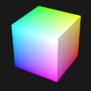

# Box Vertex Colors

## Tags

, 

## Summary

A simple unit cube that uses vertex colors, stored in the `COLORS_0` attribute. 

## Screenshot

## Description

A simple unit cube that uses vertex colors, stored in the `COLORS_0` attribute. The color of each vertex is given by the RGB colors that are defined by the vertex coordinates. So the vertex at (0,0,0) is black, the vertex at (1,0,0) is red, the vertex at (1,1,0) is yellow, ..., and the vertex at (1,1,1) is white. 

## Legal

&copy; 2023, Public. [CC0 1.0 Universal](https://creativecommons.org/publicdomain/zero/1.0/legalcode)

 - Marco Hutter for Everything

#### Assembled by modelmetadata 1.0.4-alpha