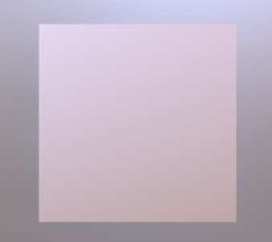

# Multiple Scenes

## Tags

, 

## Summary

A simple glTF asset with two scenes. Each scene consists of one node with one mesh. 

## Screenshot

## Description

A simple glTF asset with two scenes. Each scene consists of one node with
one mesh. For the first scene, the mesh is a triangle. For the second 
scene, the mesh is a square. The default scene is set to `1` by the `scene` 
property, so viewers should initially show the scene containing the square. 

## Legal

&copy; 2017, Public. [CC0 1.0 Universal](https://creativecommons.org/publicdomain/zero/1.0/legalcode)

 - Public for Everthing

#### Assembled by modelmetadata 1.0.3-alpha