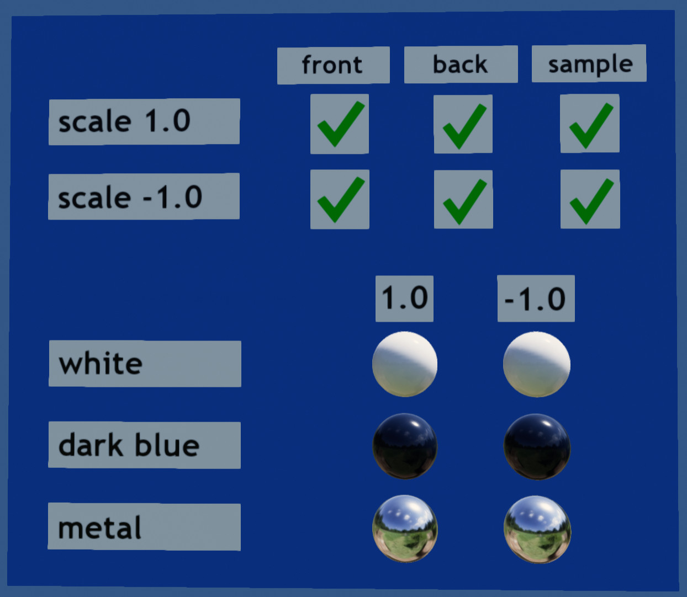
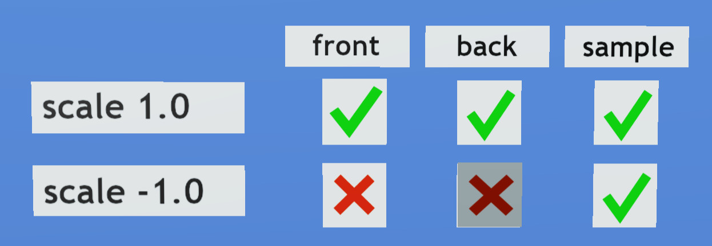

# Negative Scale Test

## Tags

, 

## Summary

This model tests what happens when a glTF node has negative scaling. [[Display](https://github.khronos.org/glTF-Sample-Viewer-Release/?model=https://raw.GithubUserContent.com/DRx3D/glTF-Sample-Assets/main/./Models/NegativeScaleTest/glTF-Binary/NegativeScaleTest.glb) in SampleViewer; [Download GLB](https://raw.GithubUserContent.com/DRx3D/glTF-Sample-Assets/main/./Models/NegativeScaleTest/glTF-Binary/NegativeScaleTest.glb)]

## Screenshot

The above image is an example of this model's appearance when the test has passed.

### Description

This model tests what happens when a glTF node has negative scaling, such that the mesh it contains is inverted, and the vertex winding order swaps from counter-clockwise to clockwise.

As noted in the [Instantiation Section of the glTF specification](
https://registry.khronos.org/glTF/specs/2.0/glTF-2.0.html#instantiation):

> When a mesh primitive uses any triangle-based topology (i.e., _triangles_, _triangle strip_, or _triangle fan_), the determinant of the node’s global transform defines the winding order of that primitive. If the determinant is a positive value, the winding order triangle faces is counterclockwise; in the opposite case, the winding order is clockwise.

This means that when a mesh flips inside-out due to its hierarchy of transforms, the winding order is expected to become reversed (clockwise instead of counterclockwise), and features such as back-face culling and lighting need to account for this change.

Some additional test assets revealing this condition are available from the [glTF Asset Generator](https://github.com/KhronosGroup/glTF-Asset-Generator/blob/master/Output/Positive/Node_NegativeScale/README.md).

## PROBLEM: Negative Scale with Back-Face Culling

In the above image, the renderer has not properly accounted for a negative scale, resulting in back-face culling being inappropriately applied to negatively-scaled meshes.  In the second row, the front face (clockwise due to negative scale) should be shown, and the back face (counter-clockwise) should be culled.  But in this image the two have swapped, resulting in red "X" marks on the second row.

The darker-colored block (bottom-middle "X") is indicative of a separate problem with normal vectors, described below.

## PROBLEM: No Back-Face Culling

Two red "X" marks in the "back" column simply indicate that this renderer does not support glTF's `"doubleSided" : false` setting with back-face culling.  Without this capability, one cannot test whether back-face culling has been appropriately applied to negatively-scaled meshes.

However, the darker blocks are indicative of a separate problem with normal vectors, described below.

## PROBLEM: Normal Vectors Flipped

The lower portion of the model contains spheres.  The `-1.0` column shown on the right has a negative scale applied, so the double-sided spheres are inside-out.  However, the above renderer has not correctly flipped the normal vectors, so the diffuse light is hitting this column from the wrong side.  This is especially visible on the white sphere in this example.  The two white spheres should be lit the same, regardless of the negative scaling on one of them.

This problem with normal vectors is likely also the cause the upper "check" and "X" blocks that appear to be lit differently from the samples.

## Legal

&copy; 2023, Analytical Graphics, Inc.. [CC BY 4.0 International](https://creativecommons.org/licenses/by/4.0/legalcode)

 - Ed Mackey for Everthing

#### Assembled by modelmetadata 1.0.5-alpha