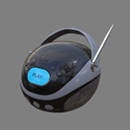
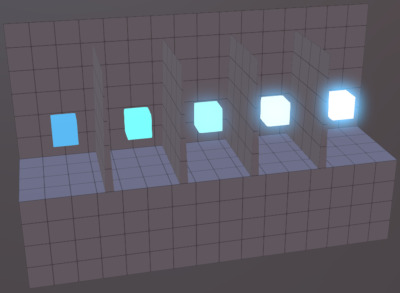
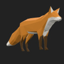
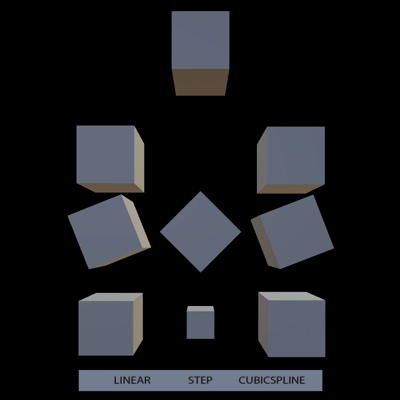
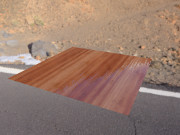
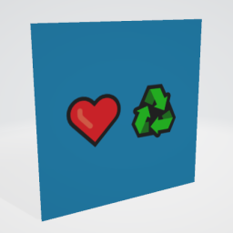

# glTF 2.0 Sample Models

## All models

| Model   | Screenshot  | Description |
|---------|-------------|-------------|
| [2 Cylinder Engine](./2.0/2CylinderEngine/README.md) |  | Small CAD data set, including hierarchy. Credit: &copy; 2017, Unknown. [Khronos-Archive]()  - Khronos for Everything &copy; 2017, Unknown. [Khronos-Archive]()  - Okino for Conversion to glTF |
| [A Beautiful Game](./2.0/ABeautifulGame/README.md) |  | Chess set using transmission and volume. Credit: &copy; 2020, ASWF. [CC-BY 4.0](https://creativecommons.org/licenses/by-nd/4.0/legalcode)  - MaterialX Project for Original model &copy; 2022, Ed Mackey. [CC-BY 4.0](https://creativecommons.org/licenses/by-nd/4.0/legalcode)  - Ed Mackey for Conversion to glTF |
| [Alpha Blend Mode Test](./2.0/AlphaBlendModeTest/README.md) |  | Tests alpha modes and settings. Credit: &copy; 2018, Analytical Graphics, Inc.. [CC-BY 4.0](https://creativecommons.org/licenses/by-nd/4.0/legalcode)  - Ed Mackey for Everything |
| [Animated Cube](./2.0/AnimatedCube/README.md) |  | Same as previous cube having a linear rotation animation. Credit: &copy; 2017, UX3D. [CC0](https://creativecommons.org/publicdomain/zero/1.0/legalcode)  - Norbert Nopper for Everything |
| [Animated Morph Cube](./2.0/AnimatedMorphCube/README.md) |  | Demonstrates a simple cube with two simple morph targets and an animation that transitions between them both. Credit: &copy; 2017, Public. [CC0](https://creativecommons.org/publicdomain/zero/1.0/legalcode)  - Microsoft for Everything |
| [Animated Morph Sphere](./2.0/AnimatedMorphSphere/README.md) |  | This sample is similar to the Animated Morph Cube, but the two morph targets move many more vertices and are more extreme than with the cube. Credit: &copy; 2017, Public. [CC0](https://creativecommons.org/publicdomain/zero/1.0/legalcode)  - Microsoft for Everything |
| [AnimatedTriangle](./2.0/AnimatedTriangle/README.md) |  | This sample is similar to the Triangle, but the node has a rotation property that is modified with a simple animation Credit: &copy; 2017, Public. [CC0](https://creativecommons.org/publicdomain/zero/1.0/legalcode)  - Unknown for Everything |
| [Antique Camera](./2.0/AntiqueCamera/README.md) |  |   Credit: &copy; 2018, UX3D. [CC0](https://creativecommons.org/publicdomain/zero/1.0/legalcode)  - Maximillan Kamps for Everything |
| [Attenuation Test](./2.0/AttenuationTest/README.md) |  | Tests the interactions between attenuation, thickness, and scale. Credit: &copy; 2021, Analytical Graphics, Inc.. [CC-BY 4.0](https://creativecommons.org/licenses/by-nd/4.0/legalcode)  - Ed Mackey for Everything |
| [Avocado](./2.0/Avocado/README.md) |  |   Credit: &copy; 2017, Public. [CC0](https://creativecommons.org/publicdomain/zero/1.0/legalcode)  - Microsoft for Everything |
| [Barramundi Fish](./2.0/BarramundiFish/README.md) |  |   Credit: &copy; 2017, Public. [CC0](https://creativecommons.org/publicdomain/zero/1.0/legalcode)  - Microsoft for Everything |
| [Boom Box](./2.0/BoomBox/README.md) |  |   Credit: &copy; 0000, . [CC0](https://creativecommons.org/publicdomain/zero/1.0/legalcode)  - Microsoft for Everything |
| [Boom Box with Axes](./2.0/BoomBoxWithAxes/README.md) |  | Shows X, Y, and Z axis default orientations. Credit: &copy; 2018, . [CC0](https://creativecommons.org/publicdomain/zero/1.0/legalcode)  - Microsoft for Everything |
| [Box](./2.0/Box/README.md) |  | One mesh and one material. Start with this. Credit: &copy; 2017, Cesium. [CC-BY 4.0](https://creativecommons.org/licenses/by-nd/4.0/legalcode)  - Cesium for Everything |
| [Box With Spaces](./2.0/Box With Spaces/README.md) |  | Box with URI-encoded spaces in the texture names used by a simple PBR material. Credit: &copy; 2017, Analytical Graphics, Inc.. [CC0](https://creativecommons.org/publicdomain/zero/1.0/legalcode)  - Ed Mackey for Everything |
| [Box Animated](./2.0/BoxAnimated/README.md) |  | Rotation and Translation Animations. Start with this to test animations. Credit: &copy; 2017, Cesium. [CC-BY 4.0](https://creativecommons.org/licenses/by-nd/4.0/legalcode)  - Cesium for Everything |
| [Box with interleaved position and normal attributes](./2.0/BoxInterleaved/README.md) |  | Box example with interleaved position and normal attributes. Credit: &copy; 2017, Cesium. [CC-BY 4.0](https://creativecommons.org/licenses/by-nd/4.0/legalcode)  - Cesium for Everything |
| [Box Textured](./2.0/BoxTextured/README.md) |  | Box with a power-of-2 texture. Credit: &copy; 2017, Cesium. [CC-BY 4.0 and TM]()  - Cesium for Everything |
| [Box Textured](./2.0/BoxTexturedNonPowerOfTwo/README.md) |  | Box with a non-power-of-2 (NPOT) texture. Not all implementations support NPOT textures. Credit: &copy; 2017, Cesium. [CC-BY 4.0 and TM]()  - Cesium for Everything |
| [Box Vertex Colors](./2.0/BoxVertexColors/README.md) |  | Box with vertex colors applied. Credit: &copy; 2017, Unknown. [Unknown]()  - Michael Feldstein for Everything |
| [BrainStem](./2.0/BrainStem/README.md) |  | Animations. Skins. Credit: &copy; 2017, Smith Micro Software, Inc.. [Poser Pro EULA]()  - Keith Hunter for Everything |
| [Buggy](./2.0/Buggy/README.md) |  | Medium-sized CAD data set, including hierarchy Credit: &copy; 2017, Unknown. [Khronos-Archive]()  - Khronos for Everything &copy; 2017, Unknown. [Khronos-Archive]()  - Okino for Conversion to glTF |
| [Cameras](./2.0/Cameras/README.md) |  | A sample with two different camera objects Credit: &copy; 2017, Public. [CC0](https://creativecommons.org/publicdomain/zero/1.0/legalcode)  - Unknown for Everything |
| [Cesium Man](./2.0/CesiumMan/README.md) |  | Textured. Animations. Skins. Credit: &copy; 0000, Cesium. [CC-BY 4.0 and TM]()  - Cesium for Everything |
| [Cesium Milk Truck](./2.0/CesiumMilkTruck/README.md) |  | Textured. Multiple nodes/meshes. Animations. Credit: &copy; 0000, Cesium. [CC-BY 4.0 and TM]()  - Cesium for Everything |
| [KHR_materials_clearcoat Test](./2.0/ClearCoatTest/README.md) |  | Tests if the KHR_materials_clearcoat extension is supported properly. Credit: &copy; 2020, Analytical Graphics, Inc.. [CC-BY 4.0](https://creativecommons.org/licenses/by-nd/4.0/legalcode)  - Ed Mackey for Everything |
| [Corset](./2.0/Corset/README.md) |  |   Credit: &copy; 2017, UX3D. [CC0](https://creativecommons.org/publicdomain/zero/1.0/legalcode)  - Microsoft for Everything |
| [Cube](./2.0/Cube/README.md) |  | A cube with non-smoothed faces. Credit: &copy; 2017, UX3D. [CC0](https://creativecommons.org/publicdomain/zero/1.0/legalcode)  - Norbert Nopper for Everything |
| [Damaged Helmet](./2.0/DamagedHelmet/README.md) |  | Flight helmet with damage Credit: &copy; 2019, ctxwing. [CC-BY-4.0](https://creativecommons.org/licenses/by-nd/4.0/legalcode)  - ctxwing for Everything &copy; 2016, Stanford. [Stanford Graphics Library](http://www.graphics.stanford.edu/data/3Dscanrep/#acknowledge)  - unknown for Earlier version of license with unknown pedigree |
| [Dragon Attenuation](./2.0/DragonAttenuation/README.md) |  | Dragon with background, using material variants, transmission, and volume. Credit: &copy; 1996, Stanford. [Stanford Scan](http://www.graphics.stanford.edu/data/3Dscanrep/)  - Stanford for Original dragon model &copy; 2017, Morgan McGuire. [Stanford Scan](http://www.graphics.stanford.edu/data/3Dscanrep/)  - Morgan McGuire's Computer Graphics Archive for Conversion and clean up &copy; 2021, Public. [CC0](https://creativecommons.org/publicdomain/zero/1.0/legalcode)  - Adobe for Cloth backdrop |
| [Duck](./2.0/Duck/README.md) |  | The COLLADA duck. One texture. Credit: &copy; 2006, Sony. [SCEA Shared Source License, Version 1.0](https://web.archive.org/web/20160320123355/http://research.scea.com/scea_shared_source_license.html)  - Sony for Everything |
| [Emissive Strength Test](./2.0/EmissiveStrengthTest/README.md) |  | Tests if the KHR_materials_emissive_strength extension is supported properly. Credit: &copy; 2022, AGI. [CC-BY 4.0](https://creativecommons.org/licenses/by-nd/4.0/legalcode)  - Ed Mackey for Everything |
| [Environment Test](./2.0/EnvironmentTest/README.md) |  | A simple scene with metal and dielectric spheres that range between 0 and 1 roughness. Useful for testing environment lighting. Credit: &copy; 2017, Adobe. [Unknown]()  - Khronos for Everything |
| [Flight Helmet](./2.0/FlightHelmet/README.md) |  |   Credit: &copy; 2019, Public. [CC0](https://creativecommons.org/publicdomain/zero/1.0/legalcode)  - Microsoft for Everything |
| [Fox](./2.0/Fox/README.md) |  | Multiple animations cycles: Survey, Walk, Run. Credit: &copy; 2014, Public. [CC0](https://creativecommons.org/publicdomain/zero/1.0/legalcode)  - PixelMannen for Model &copy; 2014, tomkranis. [CC-BY 4.0](https://creativecommons.org/licenses/by-nd/4.0/legalcode)  - tomkranis for Rigging & Animation &copy; 2017, @AsoboStudio and @scurest. [CC-BY 4.0](https://creativecommons.org/licenses/by-nd/4.0/legalcode)  - @AsoboStudio and @scurest for Conversion to glTF |
| [Gearbox Assy](./2.0/GearboxAssy/README.md) |  | Medium-sized CAD data set, including hierarchy. Credit: &copy; 2017, Unknown. [Unknown]()  - Khronos for Everything &copy; 2017, Unknown. [Khronos-Archive]()  - Okino for Conversion to glTF |
| [GlamVelvetSofa](./2.0/GlamVelvetSofa/README.md) |  | Sofa using material variants, sheen, and specular. Credit: &copy; 2021, Wayfair, LLC. [CC-BY 4.0](https://creativecommons.org/licenses/by-nd/4.0/legalcode)  - Eric Chadwick for Everything |
| [Interpolation Test](./2.0/InterpolationTest/README.md) |  | A sample with three different animation interpolations Credit: &copy; 2017, Public. [CC0](https://creativecommons.org/publicdomain/zero/1.0/legalcode)  - Khronos for Everything |
| [Iridescence Dielectric Spheres](./2.0/IridescenceDielectricSpheres/README.md) |  | Tests KHR_materials_iridescence on a non-metallic material. Credit: &copy; 2019, Public. [CC0](https://creativecommons.org/publicdomain/zero/1.0/legalcode)  - Khronos for Everything |
| [Iridescence Lamp](./2.0/IridescenceLamp/README.md) |  | Wayfair Lamp model using transmission, volume, and KHR_materials_iridescence. Credit: &copy; 2022, Wayfair, LLC. [CC-BY 4.0](https://creativecommons.org/licenses/by-nd/4.0/legalcode)  - Eric Chadwick for Everything |
| [Iridescence Metallic Spheres](./2.0/IridescenceMetallicSpheres/README.md) |  | Tests KHR_materials_iridescence on a metallic material. Credit: &copy; 2022, UX3D. [CC0](https://creativecommons.org/publicdomain/zero/1.0/legalcode)  - UX3D for Everything |
| [Iridescence Suzanne](./2.0/IridescenceSuzanne/README.md) |  | Further tests KHR_materials_iridescence. Credit: &copy; 2021, . [CC-BY 4.0](https://creativecommons.org/licenses/by-nd/4.0/legalcode)  - Mathias Kanzler for Everything |
| [Iridescent Dish with Olives](./2.0/IridescentDishWithOlives/README.md) |  | Dish using transmission, volume, IOR, and specular. Credit: &copy; 2020, Wayfair, LLC. [CC-BY 4.0](https://creativecommons.org/licenses/by-nd/4.0/legalcode)  - Eric Chadwick for Everything |
| [Lantern](./2.0/Lantern/README.md) |  |   Credit: &copy; 2021, Microsoft. [CC-BY 4.0](https://creativecommons.org/licenses/by-nd/4.0/legalcode)  - Microsoft for Everything |
| [Lamp using KHR_lights_punctual Extension](./2.0/LightsPunctualLamp/README.md) |  | Lamp using punctual lights. Credit: &copy; 2021, DGG. [CC-BY 4.0](https://creativecommons.org/licenses/by-nd/4.0/legalcode)  - DGG for Everything |
| [Metal-Rough Spheres](./2.0/MetalRoughSpheres/README.md) |  | Tests various metal and roughness values (texture mapped). Credit: &copy; 2017, Analytical Graphics, Inc.. [CC-BY 4.0](https://creativecommons.org/licenses/by-nd/4.0/legalcode)  - Ed Mackey for Everything |
| [Metal-Rough Spheres (textureless)](./2.0/MetalRoughSpheresNoTextures/README.md) |  | Tests various metal and roughness values (textureless). Credit: &copy; 2019, Public. [CC0](https://creativecommons.org/publicdomain/zero/1.0/legalcode)  - Krill Gavrilov for Everything &copy; 2019, Public. [CC0](https://creativecommons.org/publicdomain/zero/1.0/legalcode)  - CAD Model generated by Draw Harness script using Open CASCADE Technology for Everything |
| [Morph-Primitives Test](./2.0/MorphPrimitivesTest/README.md) |  | Tests a morph target on multiple primitives. Credit: &copy; 2021, Analytical Graphics, Inc.. [CC-BY 4.0](https://creativecommons.org/licenses/by-nd/4.0/legalcode)  - Ed Mackey for Everything |
| [Morph Stress Test](./2.0/MorphStressTest/README.md) |  | Tests up to 8 morph targets. Credit: &copy; 2021, Analytical Graphics, Inc.. [CC-BY 4.0](https://creativecommons.org/licenses/by-nd/4.0/legalcode)  - Ed Mackey for Everything |
| [Mosquito In Amber](./2.0/MosquitoInAmber/README.md) |  | Mosquito in amber by Sketchfab, using transmission, IOR, and volume. Credit: &copy; 2018, Sketchfab. [CC-BY 4.0](https://creativecommons.org/licenses/by-nd/4.0/legalcode)  - Loic Norgeot for Model &copy; 2019, Sketchfab. [CC-BY 4.0](https://creativecommons.org/licenses/by-nd/4.0/legalcode)  - Sketchfab for Real-time refraction |
| [MultiUV Test](./2.0/MultiUVTest/README.md) |  | This model has two uv texture coordinates and tests a second set of texture coordinates. Credit: &copy; 2017, Hilo 3D. [CC-BY 4.0](https://creativecommons.org/licenses/by-nd/4.0/legalcode)  - Hilo 3D for Everything |
| [Normal-Tangent Mirror Test](./2.0/NormalTangentMirrorTest/README.md) |  | Tests an engine's ability to load supplied tangent vectors for a normal map. Credit: &copy; 2018, Analytical Graphics, Inc.. [CC-BY 4.0](https://creativecommons.org/licenses/by-nd/4.0/legalcode)  - Ed Mackey for Everything |
| [Normal-Tangent Test](./2.0/NormalTangentTest/README.md) |  | Tests an engine's ability to automatically generate tangent vectors for a normal map. Credit: &copy; 2018, Analytical Graphics, Inc.. [CC0](https://creativecommons.org/publicdomain/zero/1.0/legalcode)  - Ed Mackey for Everything |
| [Orientation Test](./2.0/OrientationTest/README.md) |  | Tests node translations and rotations. Credit: &copy; 2017, Unknown. [CC-BY 4.0](https://creativecommons.org/licenses/by-nd/4.0/legalcode)  - Khronos for Everything |
| [Reciprocating Saw](./2.0/ReciprocatingSaw/README.md) |  | Small CAD data set, including hierarchy. Credit: &copy; 2021, SharpGLTF. [CC-BY 4.0](https://creativecommons.org/licenses/by-nd/4.0/legalcode)  - SharpGLTF for Everything &copy; 2017, Unknown. [Khronos-Archive]()  - Okino for Conversion to glTF |
| [Recursive Skeletons](./2.0/RecursiveSkeletons/README.md) |  | Tests unusual skinning cases with reused meshes and recursive skeletons. Credit: &copy; 2017, Cesium. [CC-BY 4.0](https://creativecommons.org/licenses/by-nd/4.0/legalcode)  - Cesium for Everything |
| [Rigged Figure](./2.0/RiggedFigure/README.md) |  | Animations. Skins. Credit: &copy; 2017, Cesium. [CC-BY 4.0](https://creativecommons.org/licenses/by-nd/4.0/legalcode)  - Cesium for Everything |
| [Rigged Simple](./2.0/RiggedSimple/README.md) |  | Animations. Skins. Start with this to test skinning. Credit: &copy; 2017, Cesium. [CC-BY 4.0](https://creativecommons.org/licenses/by-nd/4.0/legalcode)  - Cesium for Everything |
| [Sci Fi Helmet](./2.0/SciFiHelmet/README.md) |  | Futuristic helmet Credit: &copy; 2017, Public. [CC0](https://creativecommons.org/publicdomain/zero/1.0/legalcode)  - Michael Pavlovic for Everything &copy; 2017, Public. [CC0](https://creativecommons.org/publicdomain/zero/1.0/legalcode)  - Norbert Nopper for Conversion to glTF |
| [SheenChair](./2.0/SheenChair/README.md) |  | Chair using material variants and sheen. Credit: &copy; 2020, Wayfair, LLC. [CC0](https://creativecommons.org/publicdomain/zero/1.0/legalcode)  - Eric Chadwick for Everything |
| [Sheen Cloth](./2.0/SheenCloth/README.md) |  | Fabric example using sheen. Credit: &copy; 2020, Microsoft. [CC0](https://creativecommons.org/publicdomain/zero/1.0/legalcode)  - Microsoft for Everything |
| [SimpleMeshes](./2.0/SimpleMeshes/README.md) |  | A simple scene with two nodes, both containing the same mesh, namely a mesh with a single mesh.primitive with a single indexed triangle with multiple attributes (positions, normals and texture coordinates), but without a material Credit: &copy; 2017, Public. [CC0](https://creativecommons.org/publicdomain/zero/1.0/legalcode)  - Khronos for Everything |
| [SimpleMorph](./2.0/SimpleMorph/README.md) |  | A triangle with a morph animation applied Credit: &copy; 2017, Public. [CC0](https://creativecommons.org/publicdomain/zero/1.0/legalcode)  - Khronos for Everything |
| [SimpleSkin](./2.0/SimpleSkin/README.md) |  | A simple example of vertex skinning in glTF Credit: &copy; 2017, Public. [CC0](https://creativecommons.org/publicdomain/zero/1.0/legalcode)  - Khronos for Everything |
| [SimpleSparseAccessor](./2.0/SimpleSparseAccessor/README.md) |  | A simple mesh that uses sparse accessors Credit: &copy; 2017, Public. [CC-BY 4.0](https://creativecommons.org/licenses/by-nd/4.0/legalcode)  - Khronos for Everything |
| [SpecGlossVsMetalRough](./2.0/SpecGlossVsMetalRough/README.md) |  | Tests if the KHR_materials_pbrSpecularGlossiness extension is supported properly. Credit: &copy; 2017, Microsoft. [CC-BY 4.0](https://creativecommons.org/licenses/by-nd/4.0/legalcode)  - Microsoft for Everything |
| [Specular Test](./2.0/SpecularTest/README.md) |  | Tests if the KHR_materials_specular extension is supported correctly. Credit: &copy; 2021, Analytical Graphics, Inc.. [CC-BY 4.0](https://creativecommons.org/licenses/by-nd/4.0/legalcode)  - Ed Mackey for Everything |
| [Sponza](./2.0/Sponza/README.md) |  | Building interior, often used to test lighting. Credit: &copy; 2016, Crytek. [CRYENGINE Limited License Agreement](https://www.cryengine.com/ce-terms)  - Crytek for Everything |
| [StainedGlassLamp](./2.0/StainedGlassLamp/README.md) |  |   Credit: &copy; 2021, Wayfair. [CC-BY 4.0](https://creativecommons.org/licenses/by-nd/4.0/legalcode)  - Eric Chadwick for Everything |
| [Suzanne](./2.0/Suzanne/README.md) |  |   Credit: &copy; 2017, UX3D. [CC0](https://creativecommons.org/publicdomain/zero/1.0/legalcode)  - Norbert Nopper for Everything |
| [Texture Coordinate Test](./2.0/TextureCoordinateTest/README.md) |  | Shows how XYZ and UV positions relate to displayed geometry. Credit: &copy; 2017, Analytical Graphics, Inc.. [CC0](https://creativecommons.org/publicdomain/zero/1.0/legalcode)  - Ed Mackey for Everything |
| [Texture Encoding Test](./2.0/TextureEncodingTest/README.md) |  |   Credit: &copy; 2017, Public. [CC0](https://creativecommons.org/publicdomain/zero/1.0/legalcode)  - Khronos for Everything |
| [Texture Linear Interpolation Test](./2.0/TextureLinearInterpolationTest/README.md) |  | Tests that linear texture interpolation is performed on linear values, i.e. after sRGB decoding. Credit: &copy; 2017, Public. [CC0](https://creativecommons.org/publicdomain/zero/1.0/legalcode)  - Khronos for Everything |
| [Texture Settings Test](./2.0/TextureSettingsTest/README.md) |  | Tests single/double-sided and various texturing modes. Credit: &copy; 2017, Analytical Graphics, Inc.. [CC-BY 4.0](https://creativecommons.org/licenses/by-nd/4.0/legalcode)  - Ed Mackey for Everything |
| [Texture Transform Multi Test](./2.0/TextureTransformMultiTest/README.md) |  | Tests if the KHR_texture_transform extension is supported for several inputs. Credit: &copy; 2020, Analytical Graphics, Inc.. [CC-BY 4.0](https://creativecommons.org/licenses/by-nd/4.0/legalcode)  - Ed Mackey for Everything |
| [Texture Transform Test](./2.0/TextureTransformTest/README.md) |  | Tests if the KHR_texture_transform extension is supported for BaseColor. Credit: &copy; 2018, Microsoft. [CC0](https://creativecommons.org/publicdomain/zero/1.0/legalcode)  - Microsoft for Everything |
| [Toy Car](./2.0/ToyCar/README.md) |  | Toy car example using transmission, clearcoat, and sheen. Credit: &copy; 2020, Public. [CC0](https://creativecommons.org/publicdomain/zero/1.0/legalcode)  - Guido Odendahl for Initial car model &copy; 2020, Public. [CC0](https://creativecommons.org/publicdomain/zero/1.0/legalcode)  - Eric Chadwick for Extensions and scene composition |
| [Transmission Roughness Test](./2.0/TransmissionRoughnessTest/README.md) |  | Tests the interaction between roughness and IOR. Credit: &copy; 2021, Analytical Graphics, Inc.. [CC-BY 4.0](https://creativecommons.org/licenses/by-nd/4.0/legalcode)  - Ed Mackey for Everything |
| [Transmission Test](./2.0/TransmissionTest/README.md) |  | Tests if the KHR_materials_transmission extension is supported properly. Credit: &copy; 2020, Public. [CC0](https://creativecommons.org/publicdomain/zero/1.0/legalcode)  - Adobe for Everything |
| [Triangle](./2.0/Triangle/README.md) |  | A very simple glTF asset: The basic structure is the same as in Triangle Without Indices, but here, the mesh.primitive describes an indexed geometry Credit: &copy; 2017, Public. [CC0](https://creativecommons.org/publicdomain/zero/1.0/legalcode)  - Khronos for Everything |
| [TriangleWithoutIndices](./2.0/TriangleWithoutIndices/README.md) |  | The simplest possible glTF asset: A single scene with a single node and a single mesh with a single mesh.primitive with a single triangle with a single attribute, without indices and without a material Credit: &copy; 2017, Public. [CC0](https://creativecommons.org/publicdomain/zero/1.0/legalcode)  - Khronos for Everything |
| [Two Sided Plane](./2.0/TwoSidedPlane/README.md) |  | A plane having the two sided material parameter enabled. Credit: &copy; 2017, UX3D. [CC0](https://creativecommons.org/publicdomain/zero/1.0/legalcode)  - Norbert Nopper for Everything |
| [Unicode❤♻Test](./2.0/Unicode❤♻Test/README.md) |  | A sample with Unicode characters in file, material, and mesh names Credit: &copy; 2017, Public. [CC0](https://creativecommons.org/publicdomain/zero/1.0/legalcode)  - Viktor Kovács for Everything |
| [Unlit Test](./2.0/UnlitTest/README.md) |  | Tests if the KHR_materials_unlit extension is supported properly. Credit: &copy; 2019, Analytical Graphics, Inc.. [CC-BY 4.0](https://creativecommons.org/licenses/by-nd/4.0/legalcode)  - Ed Mackey for Everything |
|  |  | _No Summary_ Credit: &copy; 0000, _No Owner_. [_No License_]()  - _No Artist_ for  |
| [Vertex Color Test](./2.0/VertexColorTest/README.md) |  | Tests if vertex colors are supported. Credit: &copy; 2018, Analytical Graphics, Inc.. [CC-BY 4.0](https://creativecommons.org/licenses/by-nd/4.0/legalcode)  - Ed Mackey for Everything |
| [Water Bottle](./2.0/WaterBottle/README.md) |  | _No Summary_ Credit: &copy; 2018, Public. [CC0](https://creativecommons.org/publicdomain/zero/1.0/legalcode)  - Microsoft for Everything |
